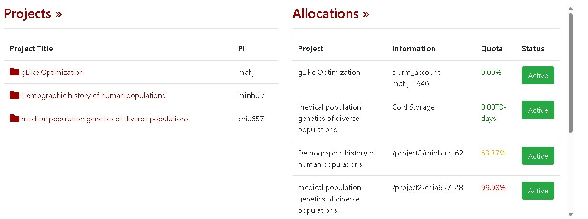
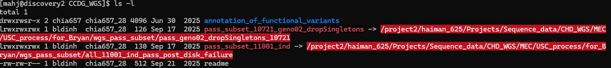
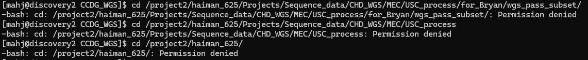

# 20260720 Cluster access, project Management, gLike on Cluster, NH meeting

## Cluster access

* I set up the USC VPN on both my laptop and home machine
* I can confirm access to `discovery.usc.edu` from on-campus wifi (as of last Friday)
* To access from off-campus, I need to use a windows powershell and directly connect to the ip of `discovery2.usc.edu`, which is pretty annoying but it still works I guess.
* I'm getting a new laptop soon. @jonmah make sure to redo this.

## Project management

I can confirm access to CARC project management and have opened a project called `gLike Optimization`. I assigned @chia657 as a project manager.

* Field of science: Genetics and Nucleic Acids
* Project Security: USC Clusters
* Project Status: Active
* Created: July 20, 2026
* Billing Admin Dept: Center for Genetic Epidemiology
* Billing Admin Name: Kimberly Louie
* Billing Admin Email: Kimberly.Louie@med.usc.edu
* Billing Admin Phone: (323) 442-3930
* Billing Cost Center: None
* Billing PPGG: None
* FBS account worktag: None

I have a single allocation under resource: `Discovery` (Cluster partition) with the slurm account `mahj_1946`. I requested "1 million hours" (free, which was approved), for an annual cost of $0 and 15TB of storage.

## gLike on Cluster (WIP)

I am currently installing / setting up a workspace on the USC cluster (**making sure not to compute on the login node**)

## Native Hawaiian (NH) meeting

* Charleston's daughter is home-free roaming around for this week, so meeting schedule is wack
* Weird ai robot is following me with a dead link --@jonmah look into this?
  * Attached to usc acc?
* Xinran update:
  * Citations update for trang
  * BMI GWAS, has the result changed with the inclusion of additional individuals?
    * Loading data might take a while, issues with compute power availability
  * Sycamore / Relate issue
    * There are no individual names in common between the ARG and phenotype file
  * Try: double-id issue?
    * ID_1 is ID_2, and phenotype file is also changed to be the same
  * Some troubleshooting
  * Proceed with newest version of sycamore
    * issues seem to be with lab id matching
  * System is horrible with lab ids (primary lab id system vs lab id system)
    * Primary lab id system is one person per id
    * Lab id system is one sample per id
    * Much of the older genetic id is in the form of lab id (one per sample), but newer data is based on primary lab id (one sample per person)
    * Format: MXXXXXX where X is some number
  * Is this a primary lab id vs. lab id issue? No overlap vs. incomplete overlap of id?
    * Try: verify if id system systems are the same
    * Try: Does the order matter? It does in a Relate tree (rearrange the phenotype file)
    * Question from Bryan: Does the script check both IDs?
* Bryan update:
  * Indexing error due to SNP IDs
    * Multiallelic variants
    * Same command as with NH and samoan data
    * Tested on chunk without multiallelic variants
    * Re-ran whole chromosome with `-m none` argument
    * Condensed Kimberli's pipeline into one script
      * Ran for everything (runs in one day due to condensed script)
      * Some arrays didn't start, but they did work on different partitions
        * `conti` partition --> `chiang` partition
        * `mega/gda/p13/p77/p99` data
        * Somoan data
        * `addPol` data
      * Kimberli is also running addPol data so to compare scores when done
      * 14 hits with 3 cohorots (not with `addPol`)
      * 5 hits with 4 cohors (including `addPol`)
      * `addPol` is a code for "additional Polynesians"
      * Look into chromosome 2?
        * @jonmah look into Bryan Dinh's PLoS Genetics paper
      * Waiting in some element on `AllOfUs` data to download certain summary statistics
* Eunice update:
  * Working on comments for poster for some sort of conference
  * Polyggenic scores for metabolic traits (e.g., BMI) explain limited phenotypical variance
    * inaccurate when applied to non-European populations
    * dietary patterns are established metabolic risk factors
    * how does cross-ancestry PGS + dietary information provide insight into BMI for five  different (multi-ethnic) ancestry groups
  * Primary lab id vs. lab id strikes again (for the poster things in lab id is fine)
* Ji update:
  * paper updates
* Eaaswar
  * MEC-NH Parents (parenthood)
    * Informative individuals by group for a variety of metrics, e.g.,
        * Individuals with at least one ilipino parent
        * Individuals with exactly one Filipino parent
        * Individuals with both Filipino parents
        * ^ ^^ ^^^ same for EastAsian parenthood
    * Ethnicity flags for parent hood
    * Doublecheck to make sure that everyone reports parental ethnicity
  * Tracts 2.0
    * Demographic modeling framework using YAML-based model and driver files
      * Sex based migration
      * Sex-specific recombination
      * Joint modeling of autosomes
    * Results are comparison of a variety of models
      * Founding time
      * Fouding POL, Founding FIL
      * NFE pulse time / proportion
        * NFE implies Filipino heritage
      * EAS pulse time / proportion
        * EAS implies East Asian
    * In prior analysis, all three algorithms ultimately infer a large amount of Filipino ancestry

### Bryan deliverable
* Bryan was very helpful in providing instructions for how to access the NH data at `/project2/chia657_28/datasets/private/MEC/WGS/CCDG_WGS/pass_subset_10721_geno02_dropSingletons`.
  * However, I appear to have run into some sort of issue where I can navigate to the file, but do not have read or write permisions for this specific directory.
  * Image: the directory name is a different color and cannot be accessed
    * based on the first character for the filetype string, it's a symbolic link to a different directory
  * When I follow the symbolic link to a different directory, I find that I also have my read access permission denied.
  * **@jonmah reach out to Bryan Dinh and/or Charleston**

# TODO
* Deliverable for @jonmah: by **end of august**, aiming to have first version of Eaaswar + Ji paper
  * fused multivariate VCF format figured out, tentatively by 3rd week of august
  * after first draft , include additional 500 people
* Coordinate with Xinran and Bryan re NH data (**Also sometime around end of August**)
  * Do I actually have access to: `/project2/chia657_28/datasets/private/MEC/WGS/CCDG_WGS/pass_subset_10721_geno02_dropSingletons`?
* Follow-up with Nate (Nstitziel)
* Follow-up with Christian Fuchsberger
* USCard should be available and active now, pick-up tomorrow