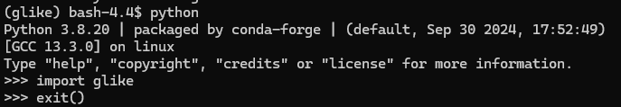
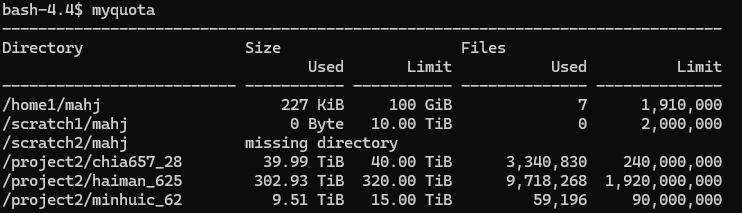
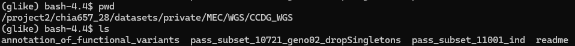

# 20260723.md: Check-in with Charleston

## Project status

### gLike
* Conda environment set up
* **IMPORTANT**
    * Replace
        ```
        from setuptools import dist, setup, Extension

        # bootstrap numpy; can we workaround this?

        dist.Distribution().fetch_build_eggs(["numpy>=1.14.5"])

        # should be fine now

        import numpy as np
        ```
    * With:
        ```
        from setuptools import setup, Extension
        import numpy as np
        ```
    * `fetch_build_eggs` is deprecated
* Installation works. 
* Progress-wise: I have run through the [tutorial](https://github.com/Ephraim-usc/glike/blob/main/tutorial.md) and am starting to look into the code.
  * Specifically of interest is the `scipy.optimize.minimize`-like `glike.maximize` functionality. I dug around a lot in this particular `scipy.optimize` function during my PhD
  * Off of the top of my head I can try implementing a few optimization strategies (to prioritize computational efficiency, global minima/maxima id, specific conditions):
    * Constrained optimization in which we ensure that parameter constraints are satisfied, e.g., one parameter larger or smaller than another, or that parameters sum to a specific value
    * Brute-force grid-based optimization, which should be better at finding global maxima with a trade off of efficiency
    * L-BFGS-B method (limited memory bfgs), which will work better when starting with parameters close to the true (global) optimum. Different starting positions are known to "burrow" to a singular optimum with this strategy. Worse when the initial guess is worse.
      * Basic idea is optimize based on matrix of second derivates but only store like 5 matrices in memory
    * Direct search / Nelder-Mead (first-derivative) approach, which will work when far from any minimum; yielding a more robust search (for finding global minima), but much slower *search* and moderately faster *computation* due to lack of gradient information.
* Could even try a combination of something like Fmin (direct search) and L-BFGS-B, trading off speed and efficiency interchangeably to get over "dips" in the likelihood surface while gliding over the "easy to search" parts

#### Notes for Jon
* Command-line for login (must be on VPN): `ssh mahj@10.72.9.14` (IP for `discovery2` CARC server works for me)
* Command-line for interactive node: `salloc --time=2:00:00 --cpus-per-task=8 --mem=16G --account=mahj_1946`
* Computing workspace: `/home1/mahj`
  * **ASK CHARLESTON ABOUT THIS**
  * Myquota indicates that I have 100GB in this workspace, as well as a scratch with 10TB, and access to `project2/chia657_28` (almost full), `project2/haiman_625`, and `project2/minjuic_62`
  * 
* `.bashrc` can be edited from home workspace.
  * `module purge`
  * `module load conda`
  * `conda init bash`
  * `source ~/.bashrc`
  * It doesn't like when I try and edit from `nano`, which is annoying (segmentation fault)
* Full installation sequence:
  * conda create -n glike python numpy=1.17.5 scipy pandas matplotlib tskit tsinfer msprime tqdm pip
  * conda activate glike
  * git clone https://github.com/Ephraim-usc/glike.git
  * cd glike
  * **Make Changes to `setup.py`**
  * python -m pip install --no-build-isolation -e .

### Native Hawaiian Data
* I can confirm access to the data.
* 
* I have recieved detailed for SFTP transfer to the Michigan Imputation panel
  * User name: `sftp-imp-refpanels-xfer`
  * Password: `8gjF-jZxA-A26L-wkYE`
  * Host: `share.sph.umich.edu`
  * Port: `2222`
* **Check-in with Charleston**
  * I can go ahead and start transfering this via `lftp` and `sftp put`
    * I'm pretty sure there's two dedicated transfer nodes on CARC for this. Looking into it


### Standards for joint multi-sample variant calling
* I have recieved instructions from Xinran regarding how to start up a Terra account, but haven't yet done so.

# Update

## NH Data
* Check in with Bryan to make sure we have the finalized data (stable and ready to go)
* Question: Does this imputation reference include singletons? Doublecheck with Bryan
* Once we have the finalized data, connect with everyone to make sure everyone is good
* Then we can upload to Michigan

## Multi-sample
* Email from Charleston to Nate
  * These people made the 1000 NH GGDG data
  * Asked many groups working on non-European and/or "special" populations for samples to contribute
  * Nate is the point-person 
  * They likely have some protocol or pipeline to go from individual sequencing data to multi-sample call format
  * Nate is hard to reach
  * Let's check the internet
* Terra has `CRAM` file, not fresh out of the sequencer, but mapped on TERRA
* Broad provided gVCF files (smaller than CRAM files per person)
* I have `gLike_optimize` project allocation -- make sure I have access to 15TB
  * Cold storage on CARC as I am considered a project manager (specifically for gVCF files)
  * Reach out to Ji Tang about physical hard drive (20 TB) as he's looking for his next position

## gLike_opt
* We want a simple read-out of real trees
  * Test our optimization scheme
  * How is this doing a better job?
    * Computational efficiency
    * Global vs. Local Minima
* Some things have been tried for heuristic
  * Grid search based on "important" parameter
  * Multiple initial guesses
* Given a set of parameters, you can find the likelihood of an ARG using gLike
  * How do we maximize those parameters
* Keep in mind we know the ground truth of the parameters the data came from
  * Is the ground truth truly the global maxima
  * Identifiability for ARGs
* Look into `https://docs.jax.dev/en/latest/_autosummary/jax.scipy.optimize.minimize.html`

## Prioritization
* Bryan's paper by the end of this year 
  * Michigan panel needs a few weeks
  * Prioritize sending the panel over
* Multi-sample variant format
  * Beginning of September -- is it possible to include this data in Ji's paper?
* gLike over time