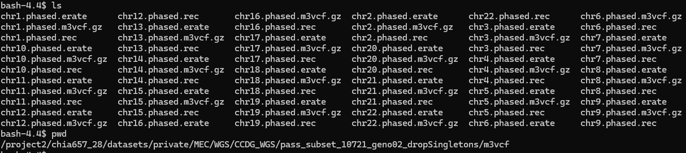

# m3vcf.md

Here is what the list of files in the `m3vcf` subdirectory looks like. There are three files per non-sex chromosome:
* `ch*.phased.erate`: Error rate file which contains the per-marker phasing / genotyping error rates. This is auxillary output for `Minimac` (reference panel pre-processing)
* `ch*.phased.m3vcf.gz`: These are the compressed reference haplotypes
* `ch*.phased.rec`: This is the recombination map used by an HMM during imputation


##  What's in a `.m3vcf.gz`

The first 7 rows of the `.m3vcf.gz` look like:
```
##fileformat=M3VCF
##version=1.2
##compression=block
##n_blocks=7265
##n_haps=21442
##n_markers=882605
##<Note=This is NOT a VCF File and cannot be read by vcftools>
```

The 8th row contains: `#CHROM  POS  ID  REF  ALT  QUAL  FILTER  INFO  FORMAT`, followed by a list of tabbed haplotype ID's.

The haplotype ID's take the form of:
```
TWGK-EC000378_HAP_1
TWGK-EC000378_HAP_2
TWGK-EC000413_HAP_1
TWGK-EC000413_HAP_2
TWGK-EC000572_HAP_1
TWGK-EC000572_HAP_2
TWGK-EC000573_HAP_1
TWGK-EC000573_HAP_2
TWGK-EC000583_HAP_1
TWGK-EC000583_HAP_2
```
Where `TWGK` presumably refers to the Taiwan Genome Project reference panel, `EC******` refers to some sort of anonymized participant ID, and `HAP_1` or `HAP_2` refer to the two haplotypes per individual.

There are 21442 unique haplotype IDs and 10721 unique participant IDs. This is true for all 22 autosomes.

## TODO
* Remove individual (bug Bryan for information)
* Change EC IDs
* get Bryan's pipeline for m3vcf files
* Generate m3vcf files
  * Compare with previous results to see if there's the same