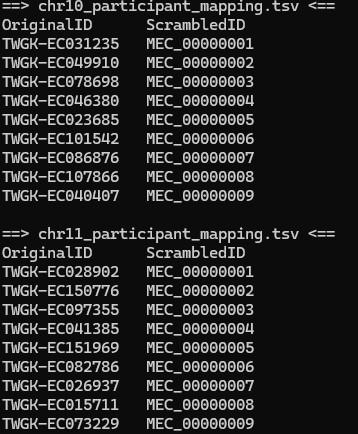

# 20260803

## NH / MEC imputation

1. Sample `TWGK-EC025837` removed
2. Generate MECXXXXXXXX ID for each remaining participant
3. Save internal dictionary for this chromosome
4. All internal dictionaries are saved in `/project2/mahj_1946/nh_imputation/Data/vcf_scrambled/mappings`
5. Sanity check: 
  a. If we want, for ease of use with `pandas` or `awk`, we could concatenate all of the `mapping.tsv` files into a single 2-column `mapping.tsv`; however, this would somewhat defeat the purpose of seperating the participant ID mapping files in the first place.
6. Pipeline for converting `vcf`s to `m3vcf` is running

## Literature search on GATK applications
1. GLnexus: joint variant calling for large cohort sequencing
Michael F. Lin, Ohad Rodeh, John Penn, Xiaodong Bai, Jeffrey G. Reid, Olga Krasheninina, William J. Salerno
doi: https://doi.org/10.1101/343970
  a. Scalability issues for genotyping workflows: there is a computational bottleneck for jointly genotyping very large cohorts
  b. GLnexus uses per-sample gVCFs produced by GATK HaplotypeCaller. GLnexus is conceptually analogous to GenomicsDBImport --> GenotypeGVCFs
  c. Essentially a more scalable workflow for joint variant calling which incorporates elements of GATK
2. Taedong Yun , Helen Li , Pi-Chuan Chang , Michael F Lin , Andrew Carroll , Cory Y McLean
Bioinformatics, Volume 36, Issue 24, December 2020, Pages 5582–5589, https://doi.org/10.1093/bioinformatics/btaa1081
  a. DeepVariant paired with GLnexus as an alternative to GATK
  b. Similar workflow of per-sample gVCFs --> jointly merged and genotyped --> single cohort-level multi-sample VCF
  c. Similar to GATK, perform cohort-wide (multi-sample) joint genotyping using genotype likelihoods across all samples
3. Betschart, R.O., Thiéry, A., Aguilera-Garcia, D. et al. Comparison of calling pipelines for whole genome sequencing: an empirical study demonstrating the importance of mapping and alignment. Sci Rep 12, 21502 (2022). https://doi.org/10.1038/s41598-022-26181-3
  a. Benchmarking between GATK vs. BWA-MEM2 vs. DRAGEN
  b. Benchmarking between GATK HaplotypeCaller vs. DeepVariant vs. DRAGEN
  c. All use similar workflow to generate a multisample VCF
4. Nagasaki, M., Sekiya, Y., Asakura, A. et al. Design and implementation of a hybrid cloud system for large-scale human genomic research. Hum Genome Var 10, 6 (2023). https://doi.org/10.1038/s41439-023-00231-2
  a. Apply GATK HaplotypeCaller (per-sample variant discovery) + GenomicsDBImport (consolidation of gVCFs) + GenotypeGVCFs (cohort-wide joint genotyping) = single multi-sample VCF.
  b. Scalability of GATK workflow for 11,238 whole genomes
  c. Traditionally, joint genotyping would be a primary computational bottleneck for large-scale human whole-genome sequencing; but the standard GATK pipeline worked fairly well at scale
5. Mirchandani CD, Shultz AJ, Thomas GWC, Smith SJ, Baylis M, Arnold B, Corbett-Detig R, Enbody E, Sackton TB. A Fast, Reproducible, High-throughput Variant Calling Workflow for Population Genomics. Mol Biol Evol. 2024 Jan 3;41(1):msad270. doi: 10.1093/molbev/msad270. PMID: 38069903; PMCID: PMC10764099.
  a. `snpArcher` is a similar workflow to the GATK joint-calling approach
  b. It incorporates GATK HaplotypeCaller, GenomicsDBImport, and then GenotypeGVCFs
  c. Major contribution is automation / reproducibility of GATK workflow, particularly usable with HPC clusters

# TODO
* Large memory or long time node --> check out Endeavor server (our lab has specific nodes)
* Check out 1 week node
* In the future look to put `gVCF` files onto physical hard drive and cold storage
* Figure out how to release data on `dbgap` (mostly paperwork), Terra --> `dbgap`
* Talk to Ji Tang for real data NH data or "true tree" or "inferred tree"