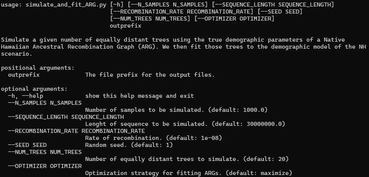
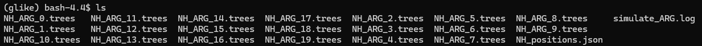
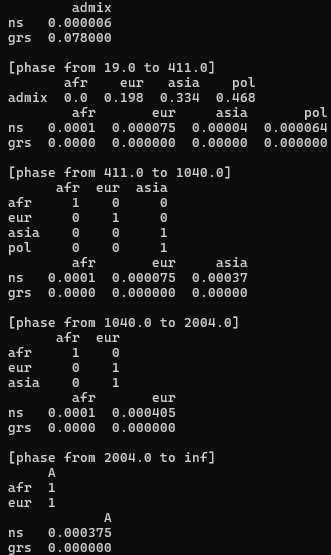
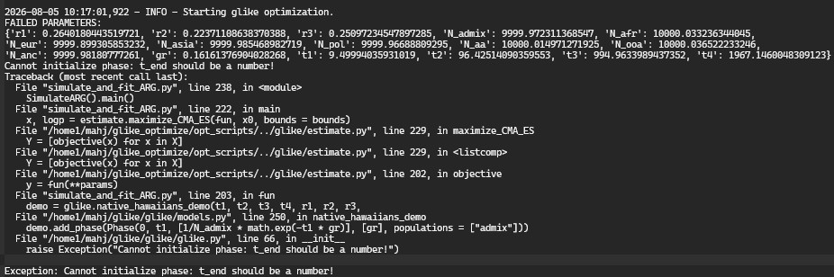

# 20260805  

## gLike current optimization function

* Current optimization approach is [here](https://github.com/Ephraim-usc/glike/blob/main/glike/estimate.py#L67)
    * Best described as a greedy coordinate descent.
    * Each epoch/generation of the iterator, we evaluate each param independently, holding all other params fixed
    * Whichever positive or negative stepsize for a given coordinate best improves likelihood --> selected
    * Every accepted move across the surface is guaranteed to increase objective function
    * There is an adaptive component by which wheneve rmovement in one direction improves the objective function, we take bigger steps.
    * If movement in either direction does not improve the objective, we take smaller steps along that coordinate
    * This is kind of like a Powell method
    * Notably, derivative and gradient free, single-param (or single direction) optimization, and can work well for convex multi-dimensional surfaces at the cost of accuracy
    * Biggest area of improvement would be to traverse multiple parameters simultaneously in an optimal direction (off the top of my head)

## Implementation: General benchmarking pipeline
* [Covariance matrix adaptation evolution strategy (CMA-ES)](https://en.wikipedia.org/wiki/CMA-ES)
* Start by simulating ARG with equidistant trees
* 
    * Number of samples, sequence length, recombination rate, random seed, number of trees, different optimizers
* Confirm that 20 different equidistant trees are simulated:
* 
* Confirm we can compute the true NH demography from the tutorial
* 
* 
    * The primary issue I'm running into with this implementation is the requirement for boundaries in CMA-ES.
    * Specifically, CMA-ES requires finite boundaries, which poses an issue in the case of derived population times in ARGs, e.g., `t1 < t2 < t3 < t4`
    * I'm using a workaround in which we can encode input parameters (similar to a log-transform) from ti --> dti, where:
        * dt1 = t1
        * dt2 = t1 + t2
        * dt3 = t1 + t2 + t3
        * dt4 = t1 + t2 + t3 + t4
        * We then use dt1, dt2, dt3, dt4 all less than 1 which satisfies both the CMA-ES constraints and the biological constraints of the ARG
    * I'm having some trouble actually implementing this transform

# TODO
* In the future look to put `gVCF` files onto physical hard drive and cold storage
* Figure out how to release data on `dbgap` (mostly paperwork), Terra --> `dbgap`
