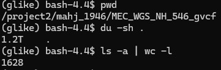
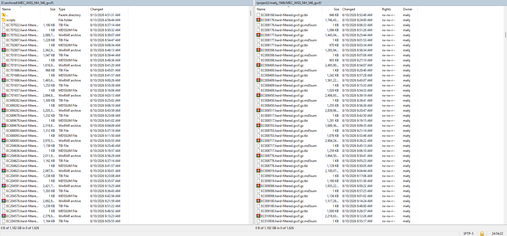

# 20260817

## 546 NH `gVCF` files
* `gvcf` files have been saved on my `project2` space.
    * 
* `gvcf` files have been saved to the Elements hard drive, still stored in my office space
    * 

## gLike Benchmarking
* I've been tackling a few key questions:
    * Question 1: Does the number of trees affect the relative log likelihood of a fit, given the same set of initial conditiosn?
    * Question 2: If given the true simulation parameters as starting parameters, how does the standard gLike optimizer handle these initial conditions?
    * Question 3 (WIP): Is CMA-ES a "better" optimizer than the standard gLike optimizer?
    * Question 4 (WIP): Does a log likelihood parameter transform improve runtime or fit?
* To tackle these questions, I set up a set of simulation / fitting jobs.
    * Varying the number of trees from 1-20
        * Varying the initial conditions:
            * Using a "standard" set of initial condition (based on gLike documentation)
            * Using the true simulation parameters as initial conditions (to test for the case in which the iterator somehow finds other params that fit better)
        * Simulate the standard native hawaiian model
         using `msprime`
        * Split genome into NUMTREES different equidistant trees
        * Compute the log likelihood of the true ARG parameters --> logp_true
        * Fit arg to the simulated output and compute the log likelihood --> logp_x
        * Compare logp_x to logp_true
* Arbitrary initial conditions:
    | NUMTREE | logp_x | logp_true | runtime |
    | ------- | ------ | -------- | -------- |
    | 1    | -11595.168965764871   | -11490.346261456412   | 4h 57m 55.0s |
    | 2    | -23255.293549866048   | -23014.326340593623   | 4h 31m 24.9s |
    | 3    | -34516.00796552041   | -34574.15313597546   | 3h 39m 20.9s |
    | 4    | -46008.97851301703   | -46007.92964036898   | 3h 43m 14.5s |
    | 5    | -57602.847723188584   | -57656.19177214663   | 4h 35m 49.1s |
    | 6    | -68769.3947739363   | -68910.97713724486   | 4h 28m 39.0s |
    | 7    | -80506.19047673274   | -80688.3912425454   | 4h 22m 55.8s |
    | 8    | -91828.67668214749   | -92110.04302356433   | 4h 20m 3.5s |
    | 9    | -103599.14879110621   | 103852.1301750249   | 4h 31m 22.0s |
    | 10   | -114814.55648935284   | -115577.97202309304   | 3h 58m 8.2s |
    | 11   | -126600.84073514448   | -126541.75744535157   | 4h 25m 15.6s |
    | 12   | -138248.30284521537   | -138360.36357885879   | 4h 37m 6.3s |
    | 13   | -148678.10077407598   | -149699.37505869137   | 5h 7m 54.4s |
    | 14   | -160763.51491720954   | -161202.3462876855   | 4h 29m 26.4s |
    | 15   | -172363.64902671456   | -173007.39748194552   | 4h 15m 19.0s |
    | 16   | -183788.71704638223   | -184509.43559347308   | 4h 36m 48.6s |
    | 17   | -195266.46893355504   | -195745.96172770177   | 4h 44m 8.9s |
    | 18   | -206505.21517516958   | -206987.8067480764   | 4h 42m 56.1s |
    | 19   | -218316.4707371188   | -219310.62837241986   | 4h 14m 39.3s |
    | 20   | -229685.76989039988   | -231030.16712193147   | 5h 0m 60.0s |
* "True" initial conditions
    | NUMTREE | logp_x | logp_true | runtime |
    | ------- | ------ | ------- | -------- |
    | 1    | -11449.02219934836   | -11487.013641243895   | 3h 22m 47.0s |
    | 2    | -22817.965125401097  | -23019.820971163772   | 2h 43m 49.4s |
    | 3    | -34357.40037054017   | -34589.323884104684   | 2h 56m 26.1s |
    | 4    | -45758.030939156546   | -46029.401700858834   | 4h 23m 13.9s |
    | 5    | -57244.121879477774   | -57663.93574300182   | 4h 42m 44.1s |
    | 6    | -68546.38051208953   | -68896.55531159393   | 5h 53m 22.7s |
    | 7    | -80117.3847675181   | -80712.22903118923   | 4h 41m 19.2s |
    | 8    | -91507.69726252931   | -92043.75753323105   | 3h 22m 16.9s |
    | 9    | -103011.81141177715   | 103851.37363198126   | 2h 58m 36.1s |
    | 10   | -114468.37141922988   | -115571.47408603117   | 2h 57m 31.6s |
    | 11   | -125805.14560235296   | -126579.7406975803   | 2h 13m 40.1s |
    | 12   | -137364.3694068794   | -138343.64480433546   | 2h 2m 50.2s |
    | 13   | -160116.1081812764   | -161245.37486025316   | 2h 55m 24.0s |
    | 14   | -171685.67278993476   | -172970.7618297966   | 3h 37m 58.5s |
    | 15   | -183052.11607500492   | -184489.28985116474   | 2h 44m 38.0s |
    | 16   | -183052.11607500492   | -184489.28985116474   | 2h 44m 38.0s |
    | 17   | -194504.4042610448   | -195744.34164408693   | 3h 23m 12.8s |
    | 18   | -205776.92119260645   | -207008.1376598309   | 2h 46m 58.1s |
    | 19   | -217534.00346765874   | -219357.3235833446   | 3h 28m 50.5s |
    | 20   | -22817.965125401097   | -23019.820971163772   | 3h 22m 47.0s |

## `snpArcher` vs. CCDG Methodology comparison
* Mirchandani CD, Shultz AJ, Thomas GWC, Smith SJ, Baylis M, Arnold B, Corbett-Detig R, Enbody E, Sackton TB. A Fast, Reproducible, High-throughput Variant Calling Workflow for Population Genomics. Mol Biol Evol. 2024 Jan 3;41(1):msad270. doi: 10.1093/molbev/msad270. PMID: 38069903; PMCID: PMC10764099.
  a. `snpArcher` is a similar workflow to the GATK joint-calling approach
  b. It incorporates GATK HaplotypeCaller (per-sample variant discovery), GenomicsDBImport (consolidation of gVCFs), and then GenotypeGVCFs (cohort-wide joint genotyping)
  c. Major contribution is automation / reproducibility of GATK workflow, particularly usable with HPC clusters
* CCDG Methodology
  a. GATK HaplotypeCaller (per-sample variant discovery)
  b. GVCF outputs were concatenated into complete per-sample GVCFs using **Picard MergeVcfs v2.4.1**.
  c. GATK **`ReblockGVCFs (Poplin et al. 2017)** was used to reduce GVCF size
    * Poplin   R, Ruano-Rubio   V, DePristo   MA, Fennell   TJ, Carneiro   MO, Van der Auwera   GA, Kling   DE, Gauthier   LD, Levy-Moonshine   A, Roazen   D, et al.  2018. Scaling accurate genetic variant discovery to tens of thousands of samples. bioRxiv 201178. https://doi.org/10.1101/201178, preprint: not peer reviewed.
  d. Reblocked GVCfs were combined into multi-sample Hail VariantDataset (VDS) files using `VariantDatasetCombiner`
    * Hail Team. Hail 0.2.13-81ab564db2b4. https://github.com/hail-is/hail/releases/tag/0.2.13.
  e. Joint genotyping with `GnarlyGenotyper`
  f. Variant-quality annotation using `VQSR`
    * DePristo M, Banks E, Poplin R, Garimella K, Maguire J, Hartl C, Philippakis A, del Angel G, Rivas MA, Hanna M, McKenna A, Fennell T, Kernytsky A, Sivachenko A, Cibulskis K, Gabriel S, Altshuler D, Daly M. (2011). A framework for variation discovery and genotyping using next-generation DNA sequencing data. Nat Genet, 43:491-498. DOI: 10.1038/ng.806.
  g. VDS files were converted to Hail MatrixTable (MT) format, with multi-allelic variants decomposing into bi-allelic variants
  h. Some quality control metrics (samples removed for abnormal heterozygosity, indels, consent withdrawel, relatedness, etc.)
* Comparison
  * CCDG is customized for an extremely large human WGS dataset (ReblockGVCF for scalability, QC for scalability, VDS to MT file format change for scalability, etc.)
  * CCDG input slightly differs from `snpArcher` -- CCDG uses sequencing data while `snpArher` can use `FASTQs` or SRA accessions while automatically obtaining the reference
  * Both frameworks use GATK HaplotypeCaller for variant discovery
  * Both frameworks use BWA-MEM; with CCDG using Picard MarkDubplicates to concatenate / remove duplicates and `snpArcher` marking duplicates as part of the automated workflow
  * CCDG QC is specific to human WGS, `snpArcher` is more generalizable to different organisms
  * CCDG uses Hail VDS + GnarlyGenotyper for joint-genotyping while `snpArcher` uses a more standard GATK GenomicsDBImport + GenotypeGVCFs
    * CCDG Uses VDS + Gnarlygenotyper for parallelization as well; `snpArcher` uses Snakemake
  * CCDG Output is highly QC'd WGS multi-sample callset in Hail MatrixTable format, while `snpArcher` produces a multi-sample VCF for downstream analysis.
  * **In General**, CCDG is highly customized specifically for extremely large human WGS datasets, while `snpArcher` is a generalizable, easily-implemented framework that uses standard approaches

# TODO
* Figure out how to release data on `dbgap` (mostly paperwork), Terra --> `dbgap`
* gLike
  * Benchmarking for CMA-ES (Results ETA: Tomorrow or Wed)
  * Log param transform for gLike (Implementation ETA: this week)
  * "Cloud of parameters" exploration vs. the true parameters (this is somewhat addressed by some of the above results in which I use arbitrary initial conditions vs. the true simulation parameters)
  * Kappa parameter investigation
* I reached out regarding the Michigan Imputation Panel but haven't heard back
* tsdate variational_gamma on chr 2, 3, 5, 16.

## //TODO `snpArcher` in a CCDG way
* Use `snpArcher` for the middle
* Use CCDG requirements for the input and output (fitlering, QC)
* Document process so that we can write a Methods section
* Evaluate to determine if there are batch effects in downstream analysis
  * Look for technical duplicates between our data and the CCDG data in terms of final output
  * There's about 8 individuals in both datasets