# 20260818

## Benchmarking gLike
* I used prior set-up in which the starting initial conditions where the true simulation parameters.
* I then ran 5 replicates with 1, 5, 10, 15, and 20 equidistant trees (the replicate number is equivalent to the same simulation)
* I scraped the *.log output to form a `.csv` with the log likelihoods:
    * 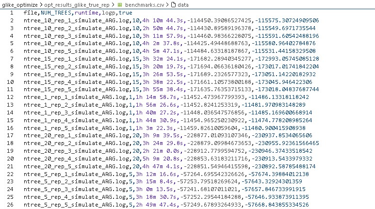
* 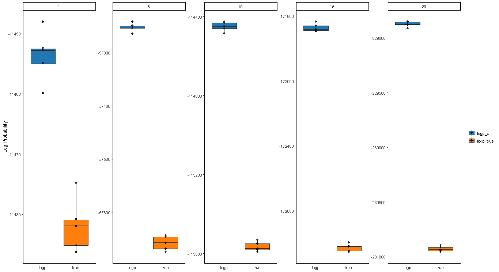
    * A priori, we found that there exist cases in which the best-fit ARG parameters yield a better log likelihood than the true underlying simulation parameters
    * We sought to further investigate if this is a consistent trend by looking through a different number of equidistant trees for the ARG --> the intuition is that 
    * Figure: Each vertical facet represents a different number of `NUM_TREES`
        * Blue data represents the `logp_x` of the best-fit params
        * Orange data represents the `logp_true` of the simulation
* I scraped the *.log output to form a `.csv` with the parameters and compared the output to the true parameters
    * Figures: Each vertical facet represents a different number of `NUM_TREES`
        * The dashed red line indicates the true underlying simulation parameter
    * 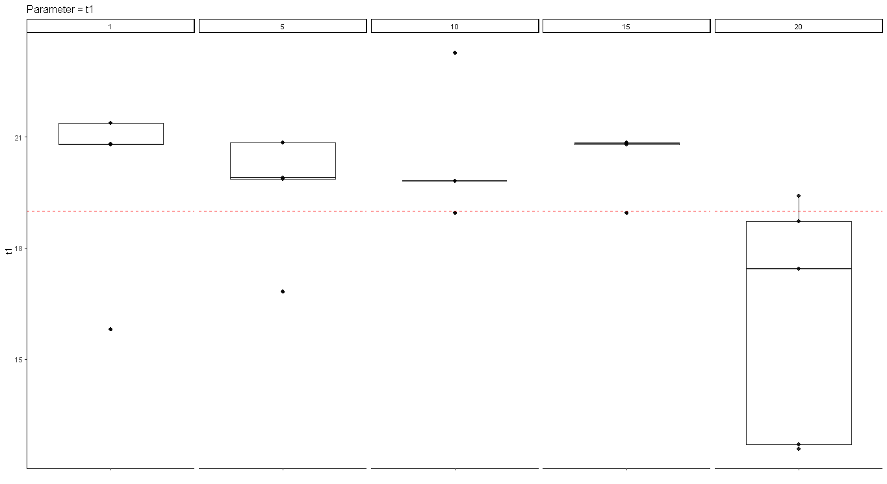
    * 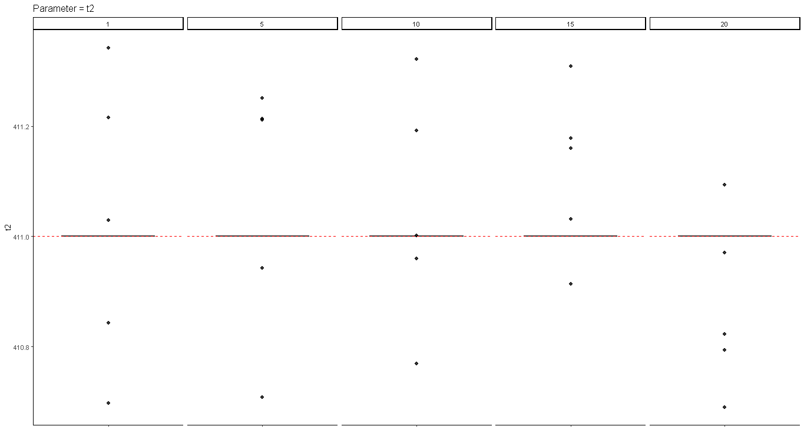
    * 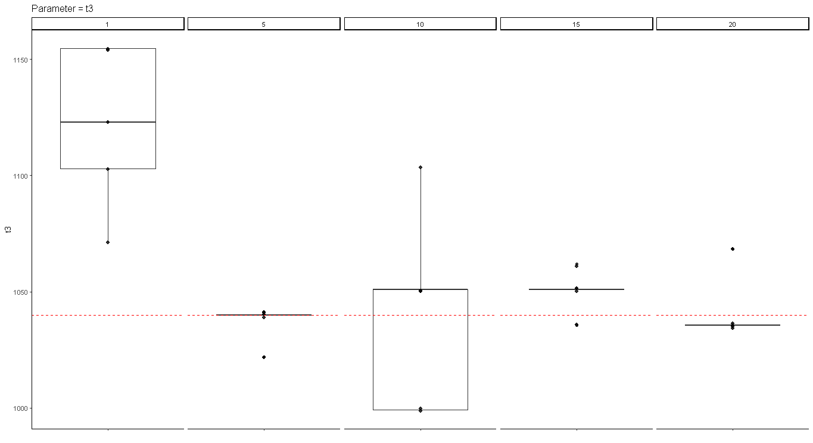
    * 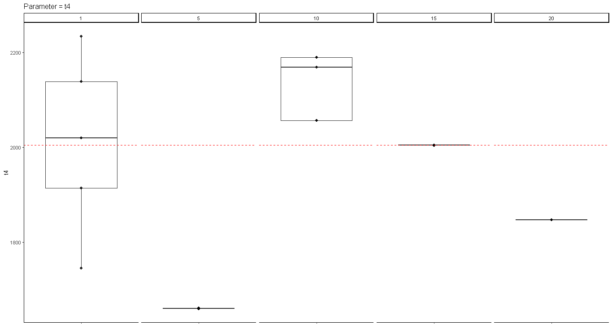
    * 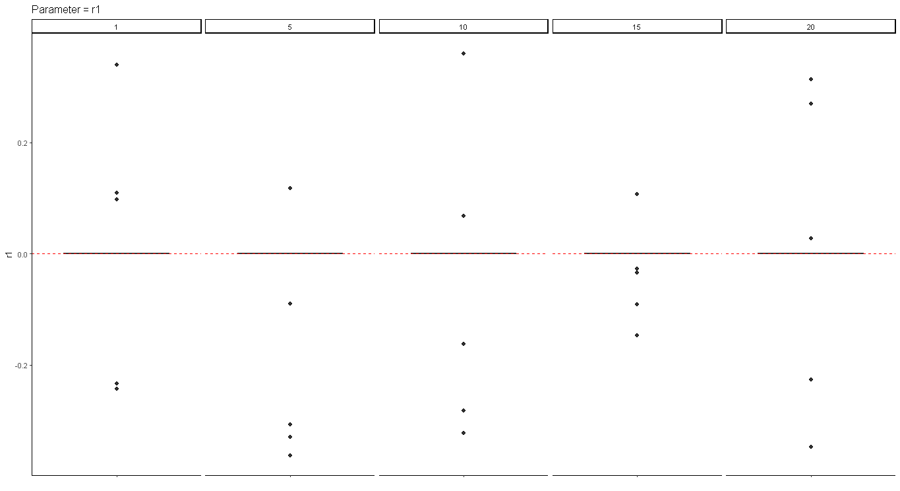
    * 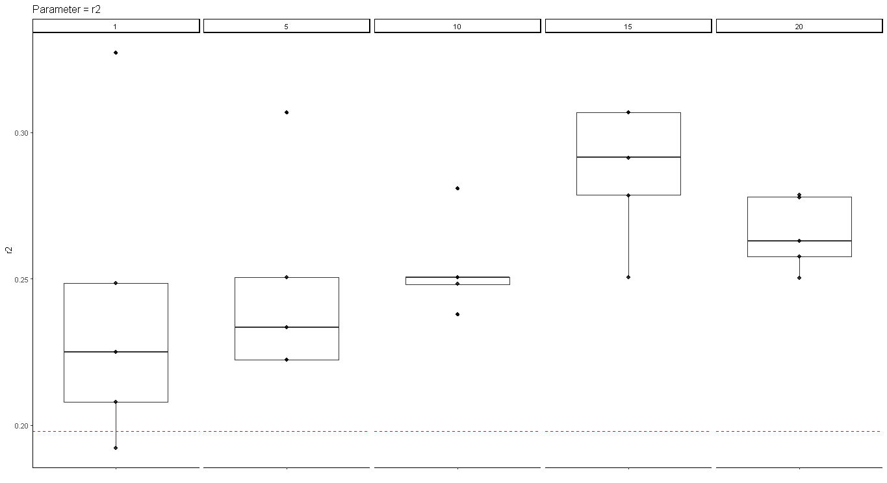
    * 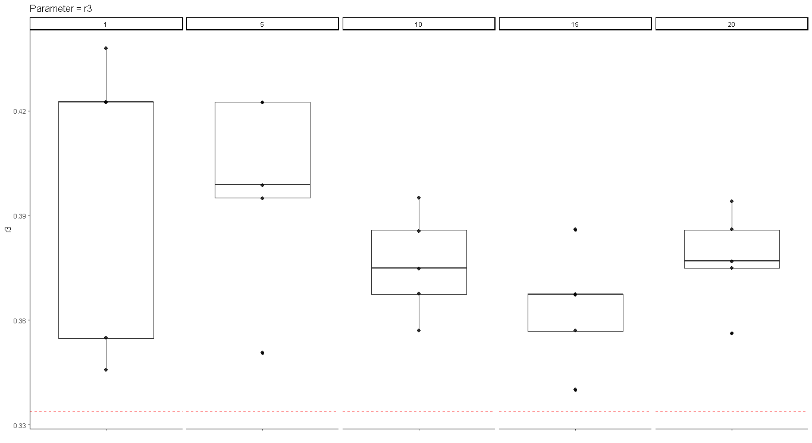
    * 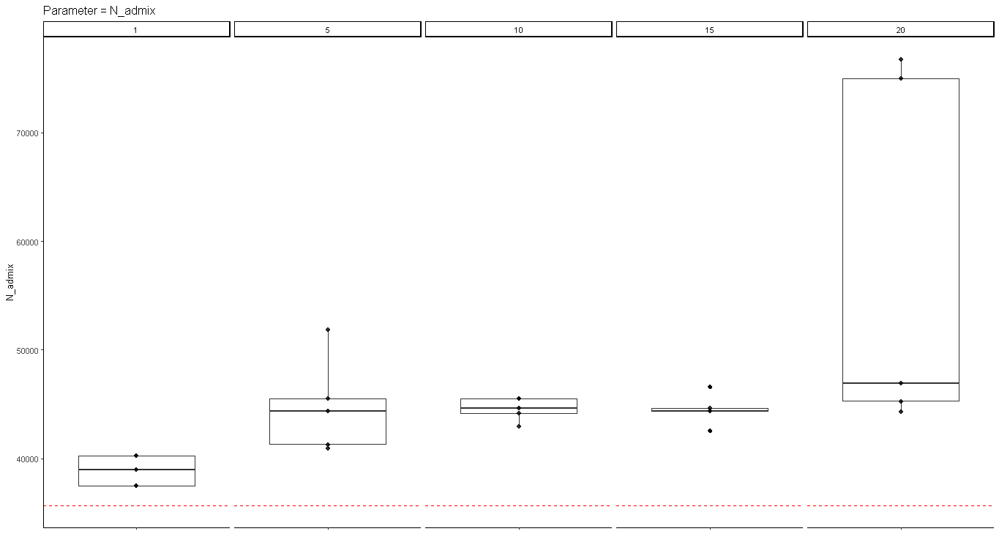
    * 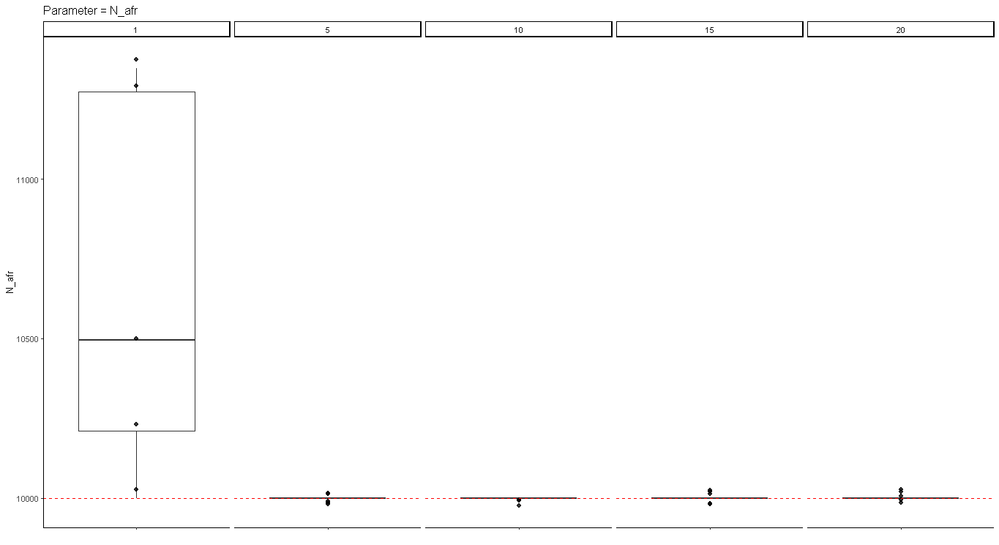
    * 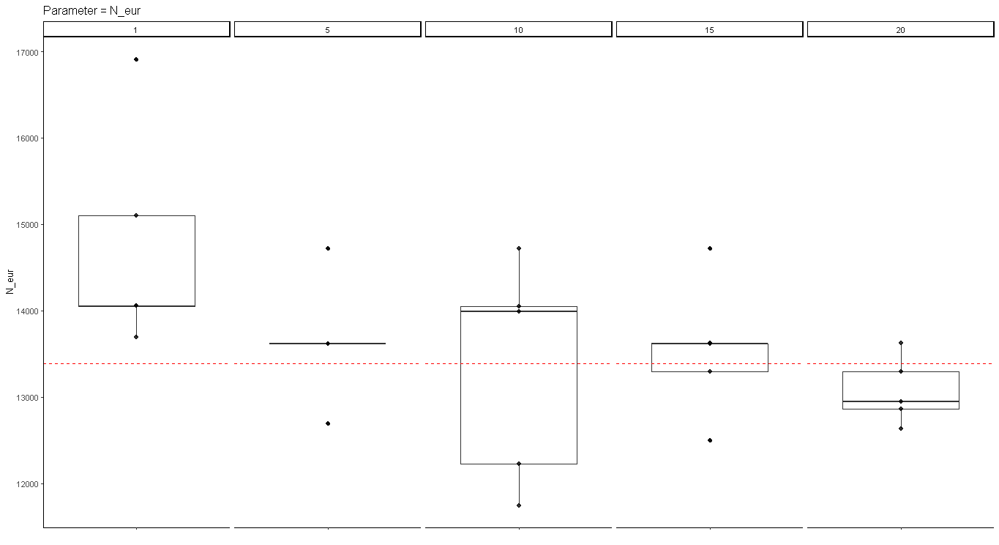
    * 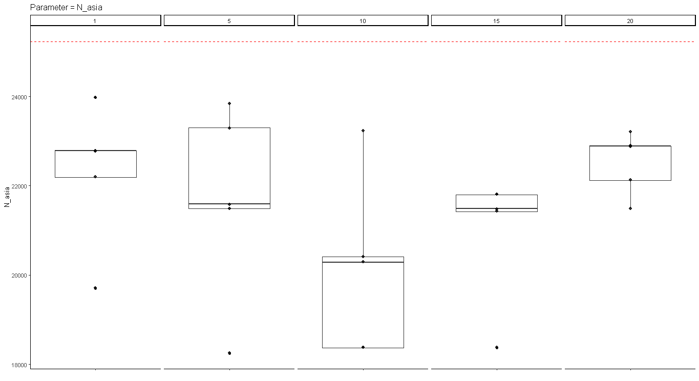
    * 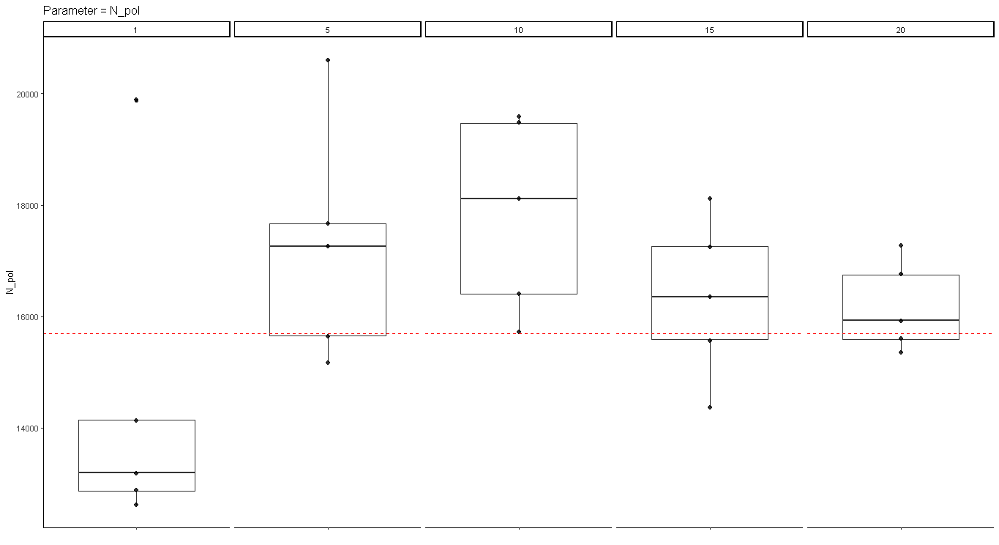
    * 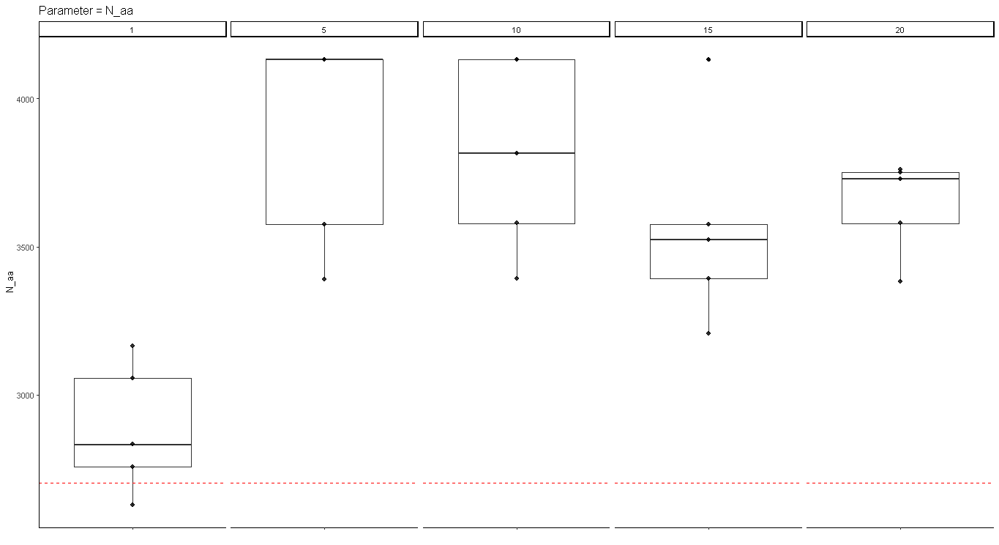
    * 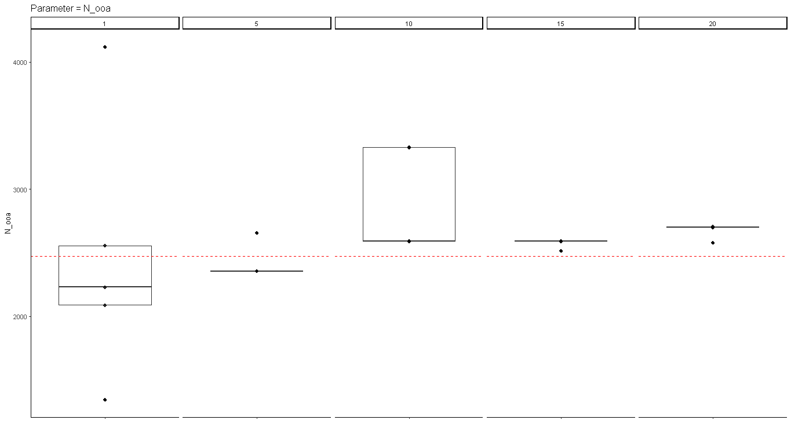
    * 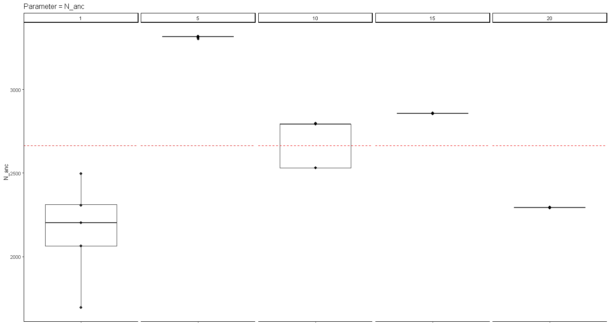
    * 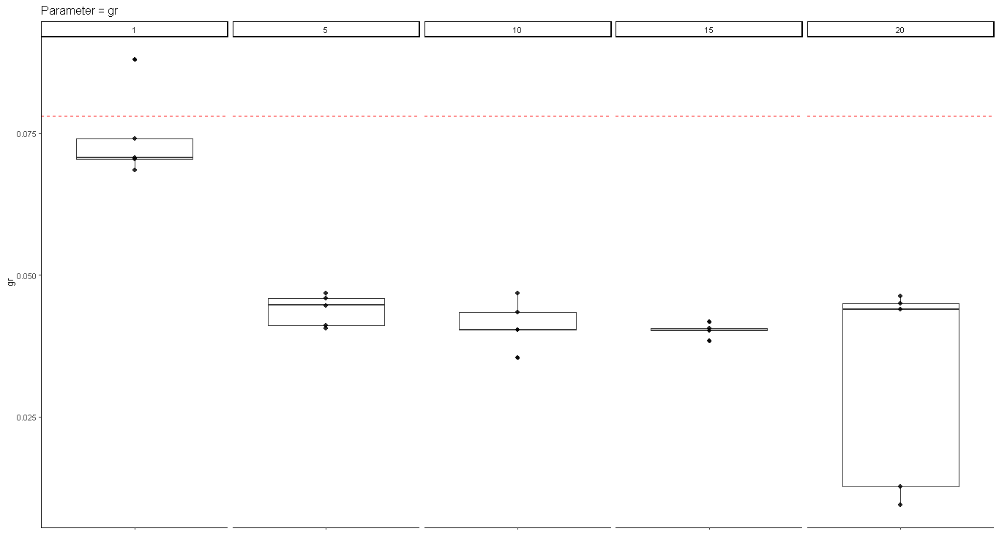
* TODO
    * Boxplots with percentage error or percentage bias
        * Arbitrary initial conditions, what is the relative error?
        * True initial conditions, what is the relative error?
    * Boxplots for loglikelihood comparison for both arbitrary and true initial starting conditions
    * Which model should we be using? Complicated or simple?
        * 3G09 three-population model without admixture
    * Finish / fix (?) CMA-ES -- Do we want to test this on which model?
        * To address param coupling
    * Fix r1, r2, r3 boundaries
    * Look into Kappa (number of sampled states), reduce sample size
        * How much of Kappa have we gotten?
        * Trade off of Kappa (number of states) vs. runtime
