# 20261819

### `variational_gamma` on NH data
* Chr 2m 3m 5m 16
* No need to use windows
* Form manhattan plots

### gLike benchmarking
* Fix r1, r2, r3 boundaries
* Boxplots with percentage error or percentage bias
    * Arbitrary initial conditions, what is the relative error?
    * True initial conditions, what is the relative error?
* Boxplots for log likelihood comparison
    * Arbitrary
    * Initial
* Results, red line indicates percentage error of 0.
    * 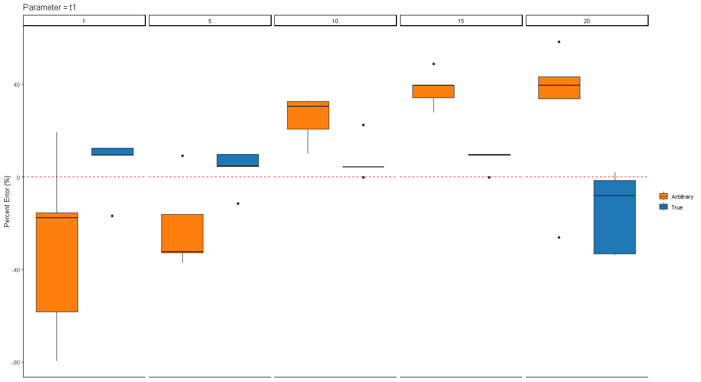
    * 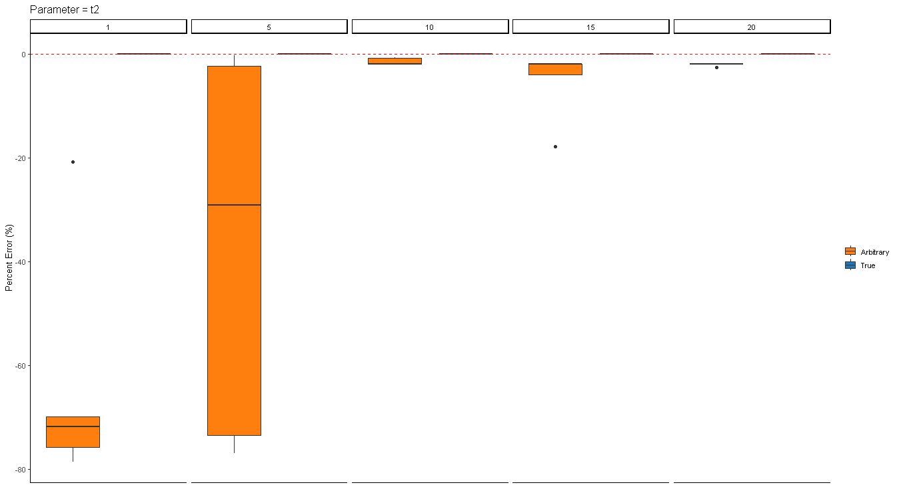
    * 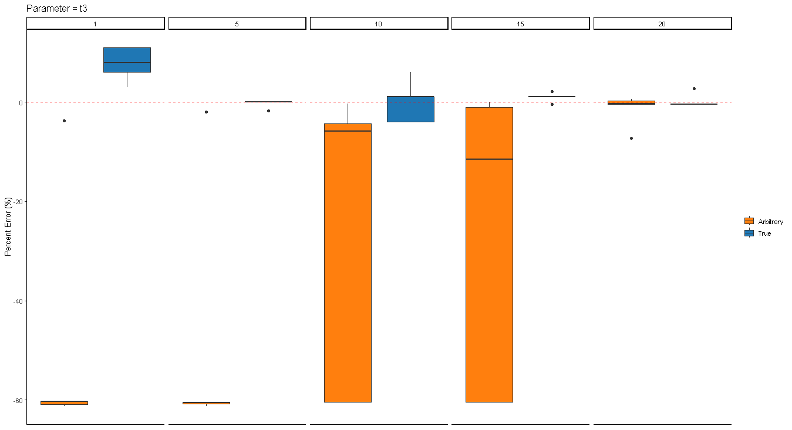
    * 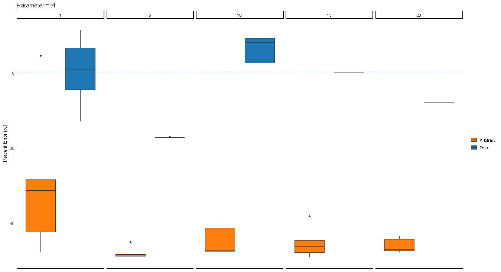
    * 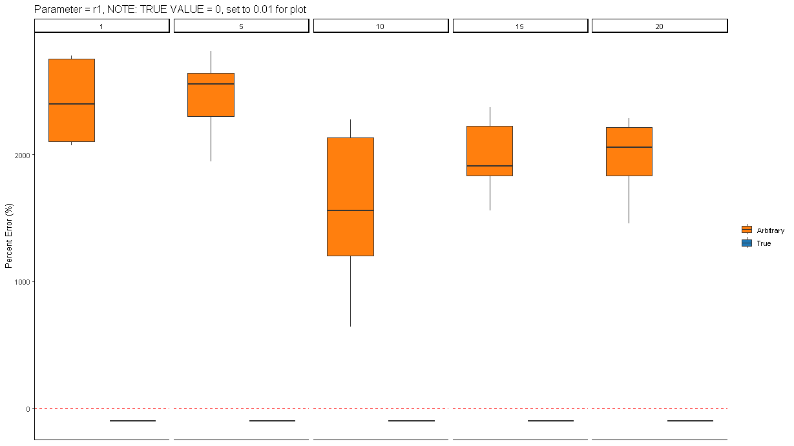
        * NOTE: For plotting, the true value of `r1` is 0.0, however, we cannot compute percentage error, thus purely for plotting purposes here I show `r1 = 0.01` as the true value. Note that the important component is that when using arbitrary initial conditions, the best-fit `r1` is higher than the true value, but when given the true value as initial conditions, we accurately recapitulate `r1`.
    * 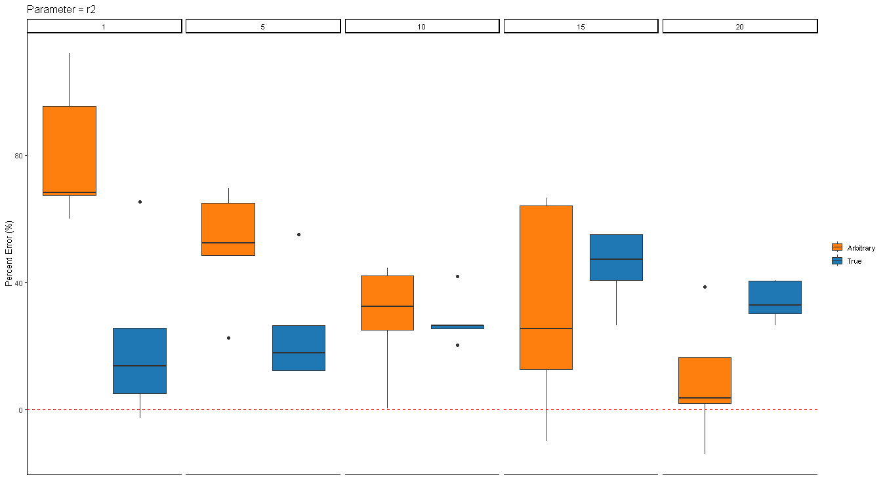
    * 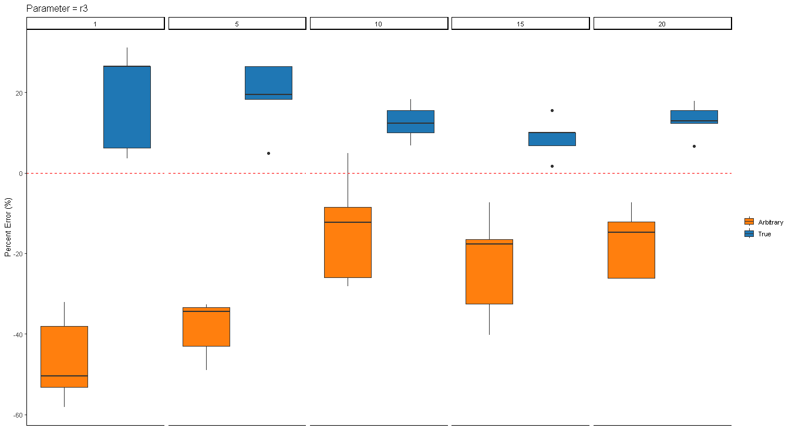
    * 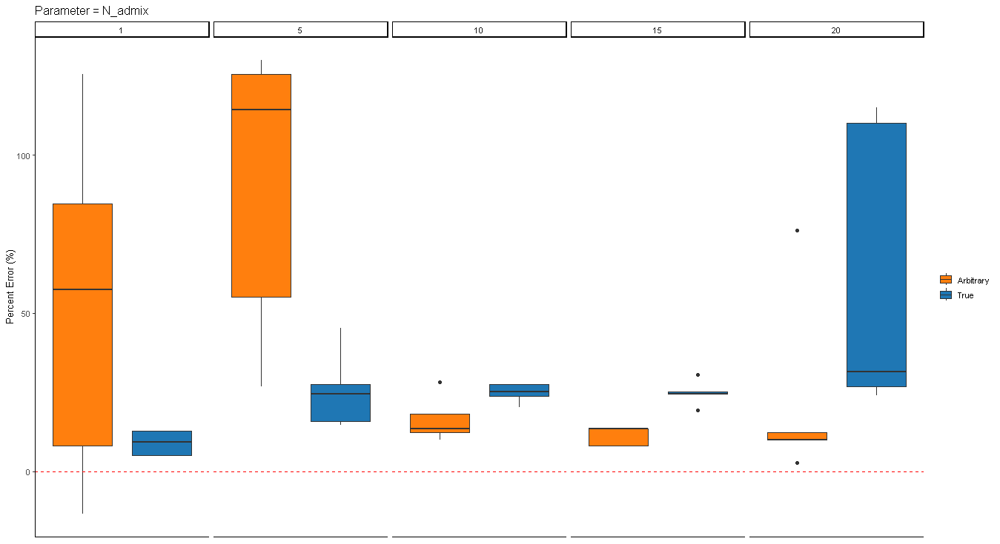
    * 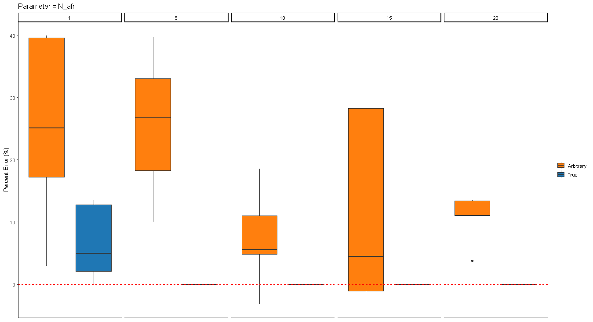
    * 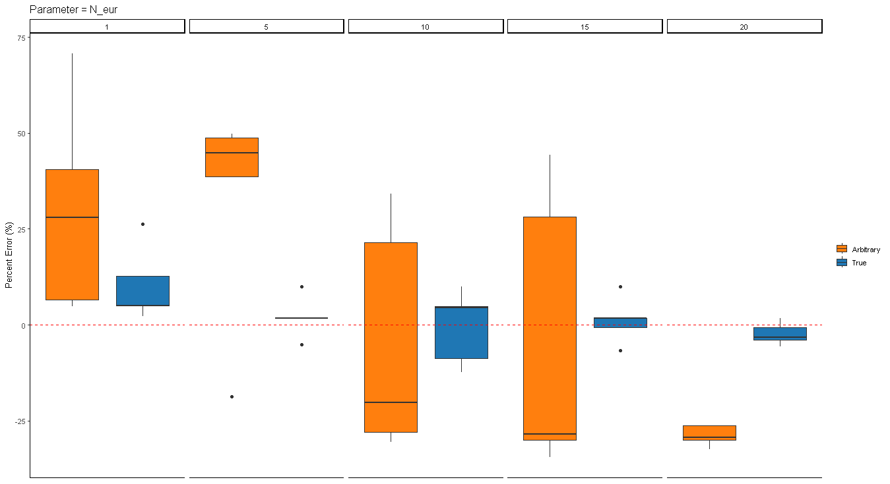
    * 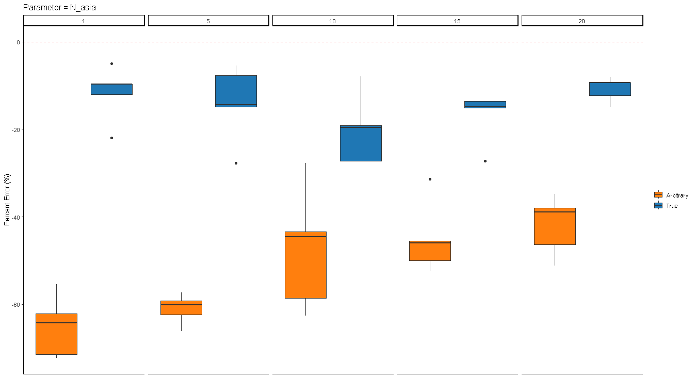
    * 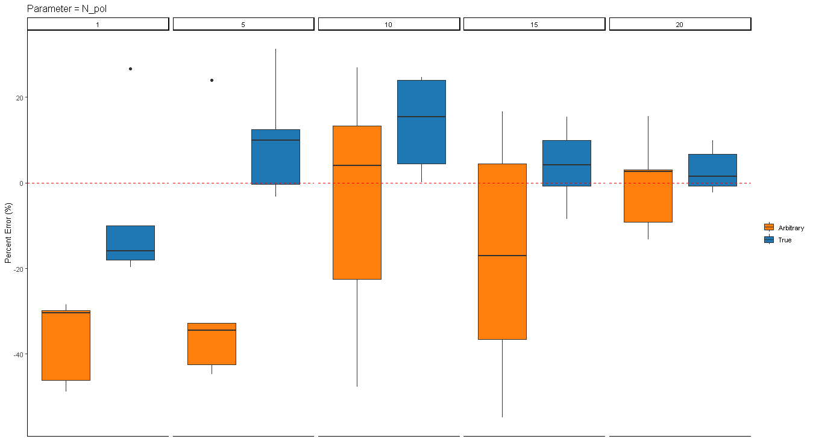
    * 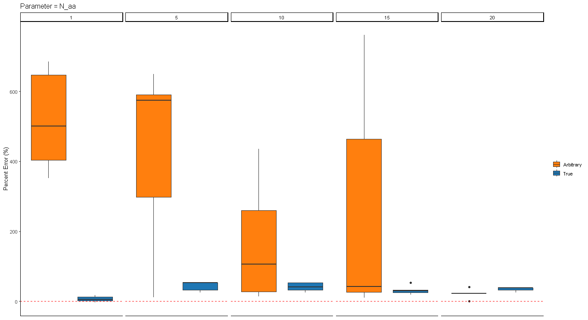
    * 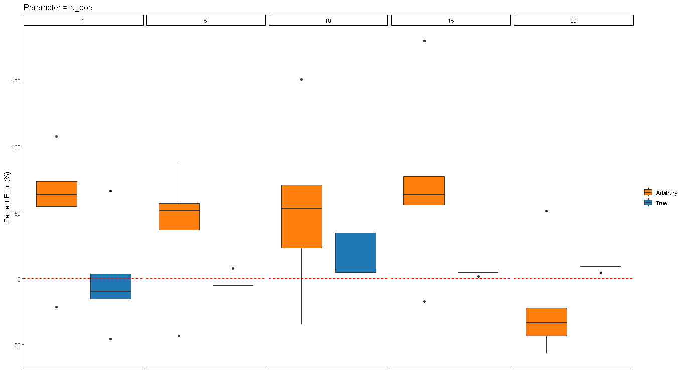
    * 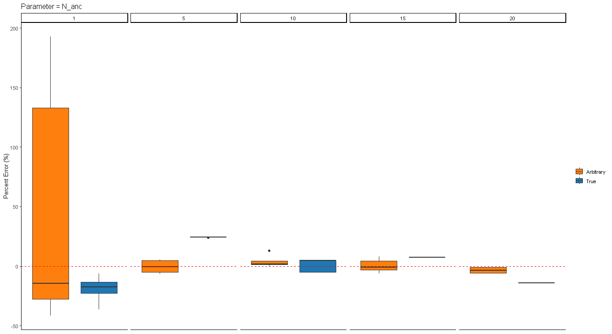
    * 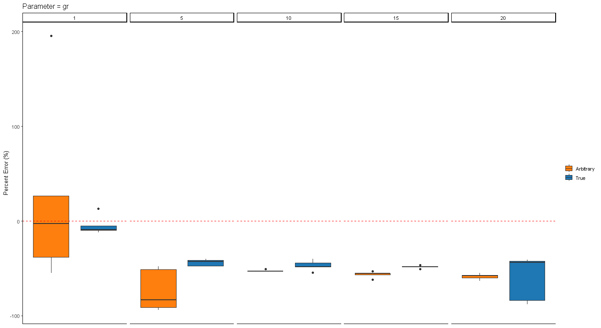