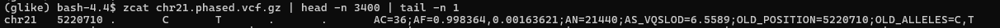
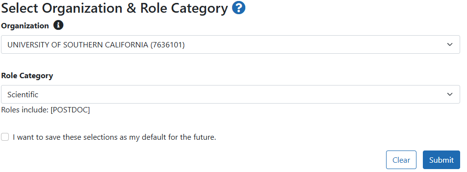
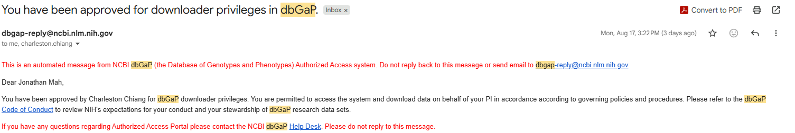
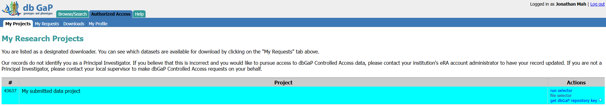

# 20261819

## gLike benchmarking
* Fix r1, r2, r3 boundaries ✓
* Boxplots with percentage error or percentage bias ✓
    * Arbitrary initial conditions, what is the relative error?
    * True initial conditions, what is the relative error?
* Boxplots for log likelihood comparison
    * Arbitrary
    * Initial
    * @jonmah TODO (I forgot to print out the log likelihood for the "Arbitrary" data oops)
* Results, red line indicates percentage error of 0.
    * 
    * 
    * 
    * 
    * 
        * NOTE: For plotting, the true value of `r1` is 0.0, however, we cannot compute percentage error, thus purely for plotting purposes here I show `r1 = 0.01` as the true value. Note that the important component is that when using arbitrary initial conditions, the best-fit `r1` is higher than the true value, but when given the true value as initial conditions, we accurately recapitulate `r1`.
    * 
    * 
    * 
    * 
    * 
    * 
    * 
    * 
    * 
    * 
    * 

## `variational_gamma` on NH data [WIP]
* Chr 2m 3m 5m 16
* No need to use windows
* Form manhattan plots
* Workflow
    1. Convert `.vcf.gz` files into `.vcz` using `vcf2zarr` via `bio2zarr`
    2. Load `vcfzarr` into `tsdata`.
    3. Note that ancestral state designation is required for `tsdata`
        * 
    4. Construct `VariantData` object in `tsdata` using `.vcz` and ancestral state designation
    5. `inferred_ts = tsinfer.infer(vdata)`
    6. Recommended to `tsdate.preprocess()` in order to remove regions with no variable sites
        * [Link here ](https://tskit.dev/tsdate/docs/stable/real-data.html#sec-real-data-preprocessing)
    7. `new_ts = tsdate.variational_gamma(ts, mutation_rate=1e-8, max_iterations=10)`

## `dbGap`
* I have confirmation for adjustment to USC association on my eRACommons
    * 
* I have confirmation for downloader priveleges on `dbGap`
    * 
* I can access and log in to `dbGap`
    * 

## GitHub redux [TODO]
* Get information from Charleston for a new github account that can be shared across the lab
* Use this for lab tutorials / wikis