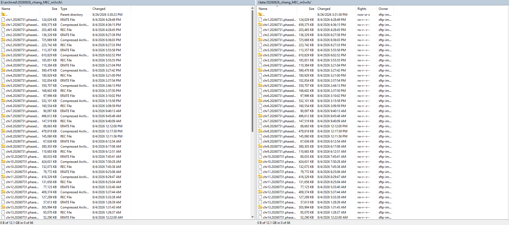
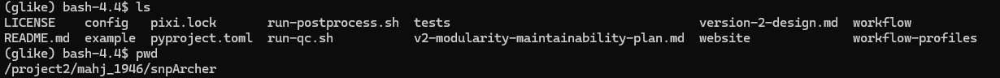
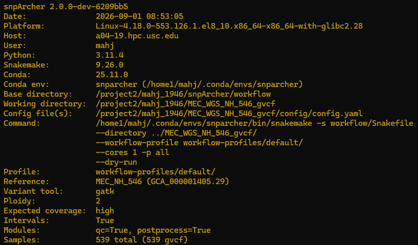

# 20260901

## Michigan Input Panel
* Upload for the scrambled `m3vcf` files to the Michigan server completed
* 

## `snpArcher` installation + troubleshooting
* I have a custom `mamba` installation as I don't know of a `mamba` module on `discovery`
    * 
* I have an installation / build for `snpArcher`
    * 
* Dry run on local installation works
    * ]
    * Works on test dataset (E. coli)
    * Command for local execution: `snakemake -s workflow/Snakefile --directory ../MEC_WGS_NH_546_gvcf/ --workflow-profile workflow-profiles/default/ --cores 1 -p all`
* Cluster execution is running for non-test case

### CCDG vs. `snpArcher`
* We match in terms of:
    * Approximate missingness (snpArcher postprocessing)
    * Sample exclusion (metadata)
    * Relatedness (snpArcher postprocessing)
    * HaplotypeCaller + MergeVcfs (methodologically similar)
    * GnarlyGenotyper vs. GATK joint genotyping (methodologically similar)
* We cannot match in terms of:
    * CCDG BWA-MEM alignment (upstream of snpArcher)
    * Duplicate marking (upstream)
    * BamID quality control (upstream)
    * Sequencing coverage (upstream)
    * CCDG ReblockGVCFs (intermediate data transform for scalability)
    * Hail VDS (intermediate data transform for scalability)
    * Downstream filtering (GQ, DP, AB)

## `tsdate variational_gamma`
* Workflow:
    1. Input A: `.bim`, `fam`, `bam` files + QC and Phasing --> `.vcf.gz`
        * NH MEGA Array (4150 samples)
    2. Input B: `vcf.gz` + `bio2zarr convert` --> `.vcz`
        * Meta-imputed NH Data, 300 randomly sampled NH WGS data
    3. `tsinfer` for a `.trees`
    4. `tsdate` for a dated `.trees`
    5. "Manhattan"-esque plot with the y-axis being time 
* Environment:
    * Note: `bio2zarr` must be version 0.1.8 to avoid conflict with `numpy >2.0`, `zarr <3`, `tsinfer == 0.5.1`, and `tsdate ==
    0.2.7` for use with `variational_gamma`

            # packages in environment at /home1/mahj/.conda/envs/tsdate_vcz:
            #
            # Name                       Version          Build                 Channel
            _openmp_mutex                4.5              20_gnu                conda-forge
            appdirs                      1.4.4            pypi_0                pypi
            asciitree                    0.3.3            py_2                  conda-forge
            attrs                        26.1.0           pyhcf101f3_0          conda-forge
            bed-reader                   1.1.0            pypi_0                pypi
            bio2zarr                     0.1.8            pypi_0                pypi
            bzip2                        1.0.8            hda65f42_10           conda-forge
            ca-certificates              2026.7.22        hbd8a1cb_0            conda-forge
            click                        8.5.0            pypi_0                pypi
            coloredlogs                  15.0.1           pypi_0                pypi
            cyvcf2                       0.31.4           pypi_0                pypi
            daiquiri                     3.0.0            pyhd3deb0d_0          conda-forge
            deprecated                   1.3.1            pyhd8ed1ab_1          conda-forge
            donfig                       0.8.1.post1      pypi_0                pypi
            fasteners                    0.20             pyhd8ed1ab_0          conda-forge
            google-crc32c                1.8.0            pypi_0                pypi
            humanfriendly                10.0             pypi_0                pypi
            humanize                     4.16.0           pyhd8ed1ab_0          conda-forge
            icu                          78.3             py310h44b86e0_2       conda-forge
            jsonschema                   4.26.0           pyhcf101f3_1          conda-forge
            jsonschema-specifications    2025.9.1         pyhcf101f3_0          conda-forge
            ld_impl_linux-64             2.46.1           default_hbd61a6d_102  conda-forge
            libblas                      3.11.0           10_h4a7cf45_openblas  conda-forge
            libcblas                     3.11.0           10_h0358290_openblas  conda-forge
            libexpat                     2.8.1            hecca717_1            conda-forge
            libffi                       3.7.0            h81df57d_1            conda-forge
            libgcc                       16.2.0           ha9f2e26_4            conda-forge
            libgfortran                  16.2.0           h69a702a_4            conda-forge
            libgfortran5                 16.2.0           h6b99dfc_4            conda-forge
            libgomp                      16.2.0           he0feb66_4            conda-forge
            liblapack                    3.11.0           10_h47877c9_openblas  conda-forge
            liblzma                      5.8.3            hb03c661_1            conda-forge
            libnsl                       2.0.1            hb9d3cd8_1            conda-forge
            libopenblas                  0.3.34           pthreads_hcf972fe_1   conda-forge
            libsqlite                    3.53.4           h13e7031_1            conda-forge
            libstdcxx                    16.2.0           h934c35e_4            conda-forge
            libuuid                      2.42.2           h5347b49_0            conda-forge
            libxcrypt                    4.4.38           h280c20c_0            conda-forge
            libzlib                      1.3.2            h25fd6f3_3            conda-forge
            llvmlite                     0.49.0           py311h1369f55_2       conda-forge
            mpmath                       1.4.1            pypi_0                pypi
            msgpack-python               1.2.2            py311h4c6fd42_1       conda-forge
            ncurses                      6.6              hdb14827_1            conda-forge
            numba                        0.67.0           py311hdfc3925_1       conda-forge
            numcodecs                    0.15.1           py311hed34c8f_1       conda-forge
            numpy                        2.0.0            pypi_0                pypi
            openssl                      3.6.4            h781a0a9_0            conda-forge
            packaging                    26.3             pyhc364b38_0          conda-forge
            pandas                       3.0.5            pypi_0                pypi
            pip                          26.2.1           pyh8b19718_0          conda-forge
            psutil                       7.2.2            py311h194be0f_2       conda-forge
            python                       3.11.16          h8ab3286_0_cpython    conda-forge
            python-dateutil              2.9.0.post0      pypi_0                pypi
            python-json-logger           4.2.0            pyhd8ed1ab_0          conda-forge
            python-lmdb                  2.3.0            py311haee01d2_0       conda-forge
            python_abi                   3.11             8_cp311               conda-forge
            pyyaml                       6.0.3            pypi_0                pypi
            readline                     8.3              hd6e31c0_1            conda-forge
            referencing                  0.37.0           pyhcf101f3_0          conda-forge
            rpds-py                      2026.6.3         py311ha6e1976_1       conda-forge
            scipy                        1.16.3           py311hbe70eeb_2       conda-forge
            setuptools                   84.0.0           pyh332efcf_0          conda-forge
            six                          1.17.0           pypi_0                pypi
            sortedcontainers             2.4.0            pyhd8ed1ab_1          conda-forge
            tabulate                     0.10.0           pypi_0                pypi
            tk                           8.6.13           noxft_h1df4ec4_4      conda-forge
            tqdm                         4.70.0           pyh8f84b5b_0          conda-forge
            tsdate                       0.2.7            pypi_0                pypi
            tsinfer                      0.5.1            py311h0372a8f_0       conda-forge
            tskit                        1.0.3            py311h0372a8f_0       conda-forge
            typing_extensions            4.16.0           pyhcf101f3_0          conda-forge
            tzdata                       2026c            h151e31d_0            conda-forge
            wheel                        0.48.0           pyhd8ed1ab_0          conda-forge
            wrapt                        2.4.0            py311h194be0f_0       conda-forge
            zarr                         3.1.6            pypi_0                pypi
            zstd                         1.5.7            hb78ec9c_7            conda-forge

## TODO
    * Look into CCDG AS_VQSLOD score to see if we can also implement
    * 