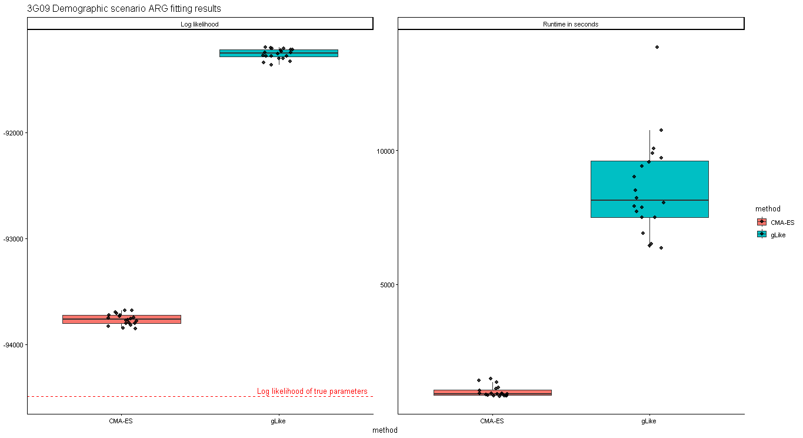
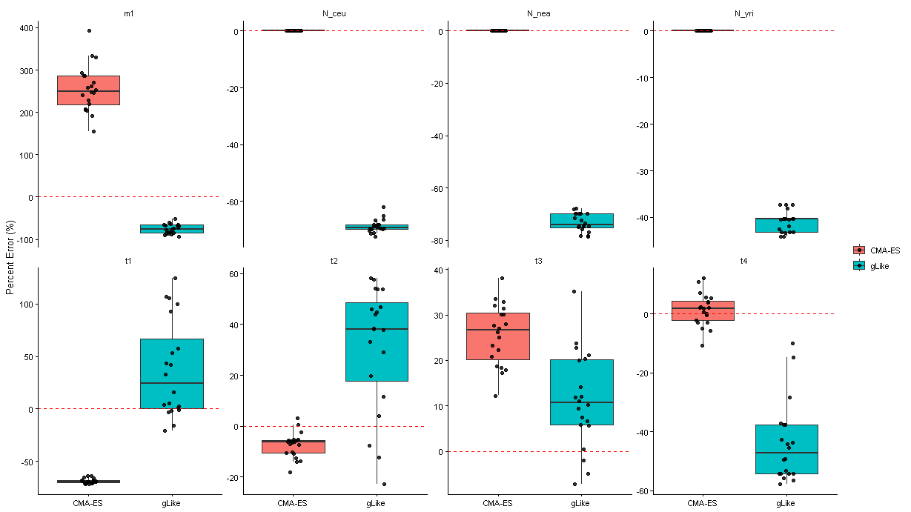
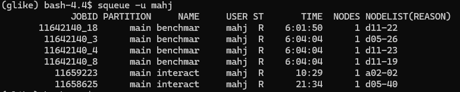

# 20260902

## Summary
* I proceeded with 10 trees
* I fixed the implementation of CMA-ES
    * NOTE: CMA-ES as currently implemented requires a pre-specified set of boundary conditions for models in which such conditions exist (e.g., migration rate, admixture proportions, etc.), otherwise the program will explore non-feasible states
    * NOTE: A present drawback of my implementation of CMA-ES is that the "tolerance" for a given iteration is the same for all parameters, i.e., at some point the iterator no longer wants to move because it believes things to be at equivalent log likelihood. However, the same tolerance point is used for all parameters, even when parameters have drastically different scaling, e.g., migration rate vs. N_Ancestral
        * I chose a tolerance of 0.05 arbitrarily
* I compare benchmarking for logp(x) and runtime between the original gLike method and CMA-ES
* I compare parameter fit relative to the true underlying parameters for the original gLike method and CMA-ES
* In all cases, I provided the same underlying simulation (as determined by seed) and same underlying true tree
* In all cases, I used 10 trees, 20 replicates, and the same initial starting conditions

## gLike vs. CMA-ES (computational benchmarking)
* 
    * CMA-ES data shown in red
    * CMA-ES seems to consistently outperform in terms of both having a shorter runtime and a better log likelihood
        * CMA-ES took on average around 15 minutes to run
        * gLike original method took on average around 2 hours to run

## gLike vs. CMA-ES (parameter)
* 
    * CMA-ES data shown in red
    * CMA-ES overestimates `m1`, the migration rate, and `t3`, while underestimating `t1`. It is otherwise fairly accurate at recovering the true simulation parameters
    * gLike underestimates `m1`, all of the effective population sizes, and `t4`, while overestimating `t2` and `t3`. It has a broad range of bidirectional percentage error across different parameters

## TODO
* Consider NH demographic scenario (I actually almost have this data)
    * : Four replicates left for `NH` demographic scenario fit by `gLike`. 
    * `CMA-ES` on average took about 17 minutes to run
    * For jobs that have finished, `gLike` original method took about 5 hours to run
* Look into parameter scaling transform so that parameter magnitude doesn't interefere with
* Take three populations: 3G09, NH (or American Admixture), ancient European (see Caoqi's paper)
    * Remove migration parameters / set to 0 --> will this fix the percentage error for estimation of t1, t2, t3, t4?
* Diagnostic plots (talk to Ji Tang) which show parameter trajectory over time
