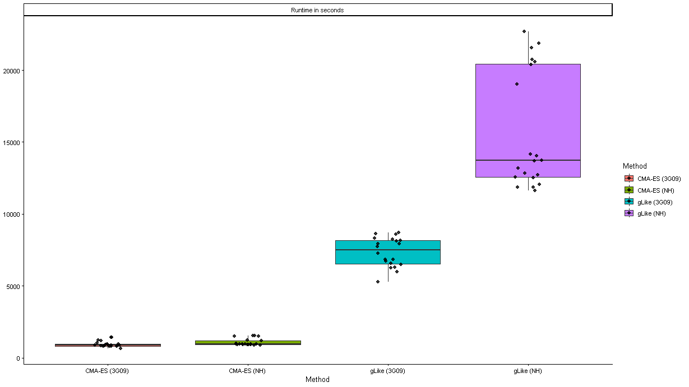
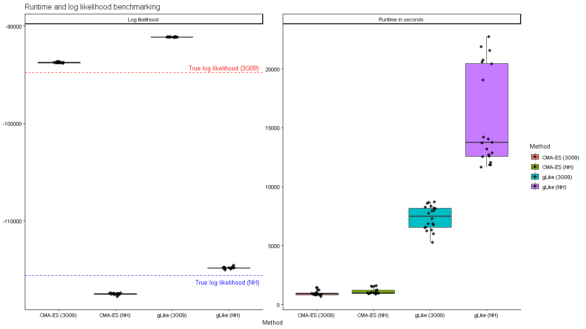
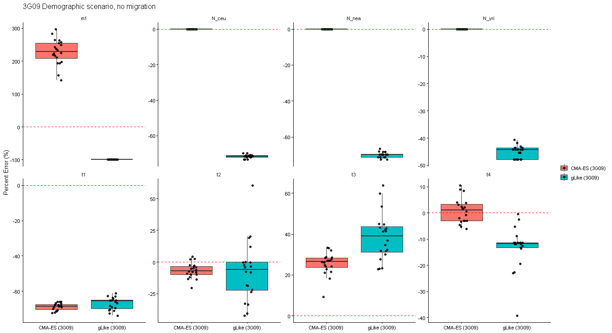
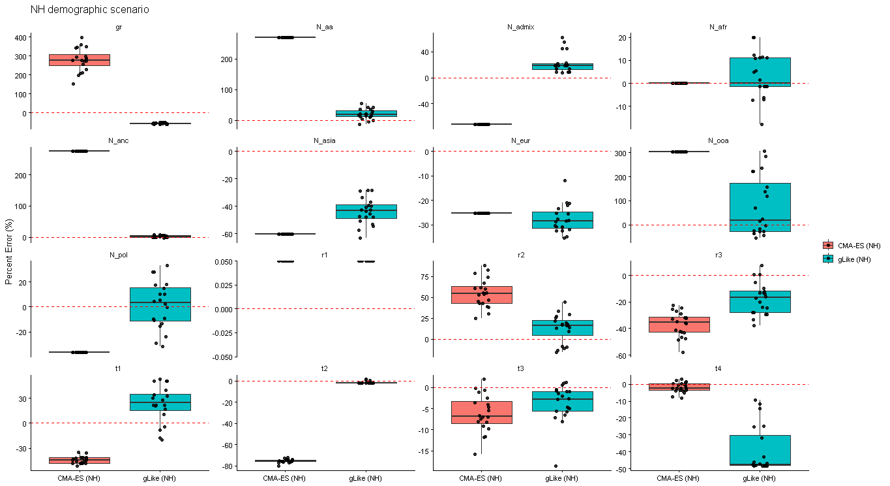

# 20260902

## Summary
* gLike is a maximum likelihood framework for demographic inference using Ancestral Recombination Graphs 
    * The currently implemented optimizer for gLike is fairly simple but straight forward. We iterate through each parameter, holding all others constant, and then step "up" or "down" in value towards a greater likelihood state. We repeat until we reach an optimum
        * Issues arise in terms of local vs. global optima due to the high dimensionality of the likelihood surface
        * Issues arise in terms of runtime, as we only change single parameters per iterative step
            * Additionally, we lack insight into correlative relationships between parameters
    * To address these issues I've implemented a different optimizer strategy: Covariance Matrix Adaptation Evolution Strategy (CMA-ES)
        * The basic premise is that we maintain a set of candidate solutions within some span or L2-norm vector distance of our current parameter state.
        * We sample the pool of candidates around us to iteratively compute a covariance matrix which gives insight into the local topology of the likelihood surface in a manner similar to computing a matrix of second derivatives (but not actually doing so). 
        * We shift the current parameter state towards the direction indicated by the covariance matrices, and then shrink the span of the candidate pool
        * We keep repeating this process until we find ourself at an optimum
        * Hypothetically, due to the widespread sampling of candidates, we avoid issues arising from topological features (ridges / plateaus)
        * Hypothetically, due to the covariance matrices, we gain insight into correlative relationships between parameter pairs
        * Hypothetically, since we change multiple parameters at once per each iteration, we more effectively "spend" likelihood calculations 

## Quick note: (4A21)
* Runtime for gLike optimizer exceeded 12 hours and the job was autocanceled
* There is an implementation bug for this demogrpahic model w.r.t CMA-ES (I need a more elegant solution)

## Benchmarking

### Runtime and log likelihood
* 
* 
    * Note that the log likelihood fit for the CMA-ES runs is **better** than the fit of the true underlying demographic paramters

### Parameter fit percentage error (3G09)
* 

### Parameter fit percentage error (NH)
* 

## TODO
* Look into parameter scaling transform so that parameter magnitude doesn't interefere with
* Take three populations: 3G09, NH (or American Admixture), ancient European (see Caoqi's paper) [WIP]
* Diagnostic plots (talk to Ji Tang) which show parameter trajectory over time
