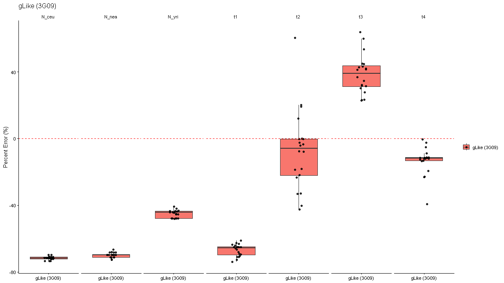
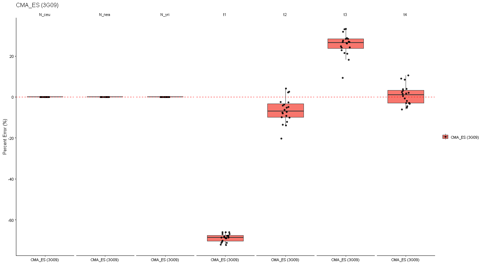
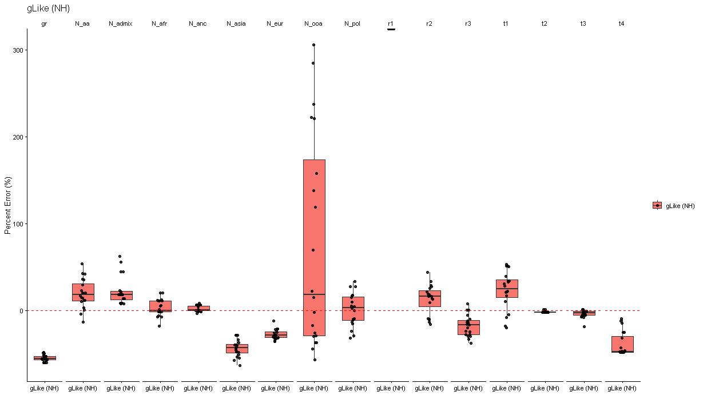
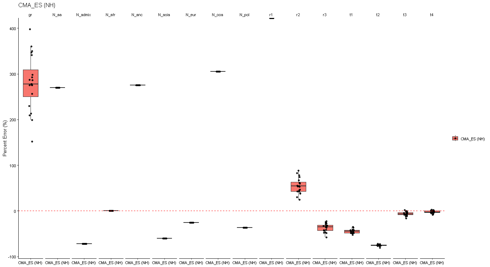
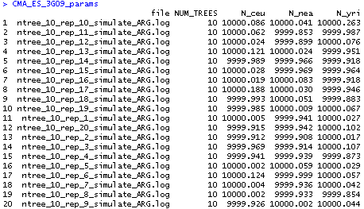
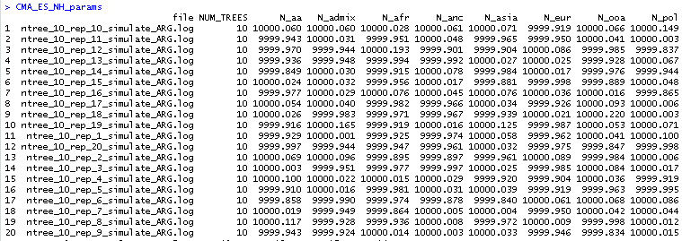

# 20260902

## Summary
* Re-ran estimates for NH and 3G09 (without migration) after fiddling with code
* Percentage errror plots horizontally arranged on the same y-axis

## Results

### 3G09 (gLike)
* 

### 3G09 (CMA-ES)
* 

### NH (gLike)
* 

### NH (CMA-ES)
* 

### Thoughts
* Something that stands out to me is the relative accuracy of inferring ancestral population size for CMA-ES in the `3G09` scenario, but inaccuracy for inferring ancestral population sizes in the NH scenario. This relationship is flipped for gLike.
* Arbitrarily, the initial condition I set for any ancestral population size is N_Anc = 10,000. It turns out that CMA-ES doesn't like to move any of the population size parameters:
    * 
    * 
    * Across all 20 replicates for both demographic scenarios there is essentially no movement for inference of N_Anc for any of the subpopulations.