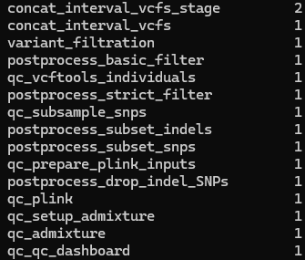

# 20260921

## `variational_gamma`
* Reworked genome chunking to address memory issues (memory allocation during genome position sorting)
* Chunk size of 10000000 (run in parallel)
    * Chr2: 242193529 bp --> 25 chunks
    * Chr3: 198295559 bp --> 20 chunks
    * Chr5: 181538259 bp --> 19 chunks
    * Chr16: 90338345 bp --> 10 chunks
* Intermediate output files saved in `array_5388/tmp` or `meta_5668/tmp` so that even if individual jobs fail due to OOM (out-of-memory) error, progress is not lost for successfuly completed segments
* Final output expected by end of day or early tomorrow

## `snpArcher`
* `snpArcher` progress:
    * 
* `concat_interval_vcfs_stage`: This job establishes ("stages") intervals for interval-specific `.vcf` files which are then concatenated, resulting in a genome-wide variant dataset.
* `concat_interval_vcfs`: Computational reassembly and concatenationg of the interval-specific `.vcf` files into the combined genome-wide variant dataset
    * **This is similar to CCDG's WGS-processesing strategy for large population-genomic projects. Computationally intensive variant calling is performed in genomic partitions. Resulting calls are then subsequently consolidated and concatenated before applying QC and filtering.**
* `variant_filtration`: Variant-level filtration for the combined variant dataset. Note that the complete set of called variants is not necessarily the same as the final set, because variant-level quality metrics are used to identify calls that do not meet the desired quality criteria (**These critera were chosen to match CCDG standards**).
* `postprocess_basic_filter`: Post-processing filter applied to the variant dataset. **Methodologically this is analogous to the CCDG approach as it consists of a progressive filtering strategy**:
    * variants produced by calling
    * variants passing initial QC criterion
    * variants passing stricter downstream crition
    * final set for analysis
* `qc_vcftools_individuals`: Individual-level quality control using `VCFtools`. **This is analogous to sample-level QC in CCDG.** In this way, both the sample-level and variant-level QC are similar between our `snpArcher` workflow and CCDG.
* `postprocess_strict_filter`: A stricter postprocessing filtering step to establish a more conserative analysis dataset. **This is in-line with the CCDG progressive filtering.**
* `qc_subsample_snps`: SNP subsampling as part of quality control. This is for reasons of computational feasibility.
* `postprocess_subset_indels`: Create a subset for INDEL variants
* `postprocess_subset_snps`: Create a seperate subset for snps. **This matches the seration of SNPs and indels in the CCDG methodology.**
* `qc_prepare_plink_inputs`: Prepare filtered data for PLINK analysis. **This matches CCDG-style workflows, in which the initial large WGS variant dataset is converted into a standardized PLINK-compatable representation.**
* `postprocess_drop_indel_SNPs`: Remove SNPs associated with INDEL-containing and overlapping variant representations. **This is analogous to CCDG methodology for constructing a snp-specific set for downstream analysis.**
* `qc_plink`: PLINK-based QC
* `qc_setup_admixture`: Quality control for analysis of SNP dataset using ADMIXTURE. **Methodologically, this is analogous to CCDG transforming data for input to ancestry/population-structure analysis.
* `qc_admixture`: ADMIXTURE analysis, output to `./results`
* `qc_qc_dashboard`: Quality control metrics output

## Next
* Once output, check quality control metrics
* Prepare full write-up of pipeline
    * With citations / references / sources
* Population-level comparison with 1065 CCDG cohort file for batch effects
* Install `README.md` for both `snpArcher` and for `tsdate_vcz`