# gLike Updates

## Summary
* Increased `kappa` from 10,000 to 50,000 
* Decreased iteration count from 20 to 10 for `gLike` optimizer (limitations of feasibility with increased `kappa`)
* Issue: `CMA-ES` struggles with certain boundary conditions.
    * Previously, boundary conditions in CMA-ES are separate from boundary conditions as defined in `gLike`.
    * I more robustly coded the requirements for boundary conditions under CMA-ES; however, we now run into an issue where, even when expanding the parameter solution space (via `kappa`), it is now possible to now have any viable solution.
    * Example 1, completely ignoring migration:
        ```
        2026-09-23 11:03:55,096 - INFO - Starting glike optimization.
        -118373.61748614724
        INVALID PARAMETERS:
        gr_chb out of bounds
        {'t1': 10.043999136561549, 't2': 50.08724747032337, 't3': 99.91507559126703, 'N_anc': 9999.98678791429, 'N_yri': 9999.967622502085, 'N_ooa': 10000.019235263459, 'N_ceu': 10000.02186468729, 'N_chb': 10000.003265262856, 'gr_ceu': 0.16121691083416861, 'gr_chb': -0.011366354495989217}
        INVALID PARAMETERS:
        gr_chb out of bounds
        {'t1': 10.019683935328361, 't2': 50.00918798044388, 't3': 100.03156250358187, 'N_anc': 9999.952808529588, 'N_yri': 10000.049070307727, 'N_ooa': 9999.97011036754, 'N_ceu': 9999.869316386134, 'N_chb': 10000.03521881822, 'gr_ceu': 0.12694492268249696, 'gr_chb': -0.025317557100928256}
        ```
    * Example 2, migration with hard boundaries [0, 0]:
        ```
        INVALID PARAMETERS:
        gr_ceu out of bounds
        {'t1': 10.013251286658283, 't2': 50.00594901051747, 't3': 100.0606671796517, 'N_anc': 9999.999400085939, 'N_yri': 9999.975419159404, 'N_ooa': 9999.925966508172, 'N_ceu': 9999.976966843664, 'N_chb': 10000.02169630029, 'gr_ceu': -0.010376072115573495, 'gr_chb': 0.11559229465073942, 'm_yri_ooa': -0.039371409720810616, 'm_yri_ceu': 0.01973351118652422, 'm_yri_chb': 0.0838702517244798, 'm_ceu_chb': -0.017496512063154206}
        FAILED PARAMETERS:
        {'t1': 10.068933150355921, 't2': 50.01511479631901, 't3': 100.01568337382449, 'N_anc': 9999.961785360176, 'N_yri': 10000.036457120239, 'N_ooa': 10000.004846293155, 'N_ceu': 9999.972305940408, 'N_chb': 10000.021836985954, 'gr_ceu': 0.0923244786709576, 'gr_chb': 0.16363009543526053, 'm_yri_ooa': 0.008168810164227294, 'm_yri_ceu': 0.011419088405857057, 'm_yri_chb': 0.001202267340570452, 'm_ceu_chb': -0.03737701398506243}
        ERROR: Exception('Cannot initialize phase: P should be all non-negative!')
        FAILED PARAMETERS:
        {'t1': 9.980076160279692, 't2': 49.9527498079828, 't3': 99.9877644004417, 'N_anc': 9999.973026839896, 'N_yri': 9999.961869569406, 'N_ooa': 10000.007381859165, 'N_ceu': 10000.051843439818, 'N_chb': 10000.0233909648, 'gr_ceu': 0.15126831412760716, 'gr_chb': 0.10658858685576687, 'm_yri_ooa': 0.0332473224394013, 'm_yri_ceu': -0.026052517593419474, 'm_yri_chb': 0.048961353531120036, 'm_ceu_chb': -0.027577488156616703}
        ERROR: Exception('Cannot initialize phase: P should be all non-negative!')
        FAILED PARAMETERS:
        {'t1': 10.057730579151078, 't2': 50.022397180721434, 't3': 99.98826745766526, 'N_anc': 10000.035558044217, 'N_yri': 10000.009722309947, 'N_ooa': 9999.994557432587, 'N_ceu': 9999.984765778625, 'N_chb': 9999.915959682641, 'gr_ceu': 0.11329707682698986, 'gr_chb': 0.03551084724302829, 'm_yri_ooa': 0.005165584635872179, 'm_yri_ceu': -0.09146127856071666, 'm_yri_chb': 0.06747784773221754, 'm_ceu_chb': -0.013051159658506714}
        ERROR: Exception('Cannot initialize phase: P should be all non-negative!')
        FAILED PARAMETERS:
        {'t1': 9.940147303684213, 't2': 50.01540713758972, 't3': 100.04175989578877, 'N_anc': 10000.01200184616, 'N_yri': 9999.946456763535, 'N_ooa': 10000.049019892962, 'N_ceu': 9999.939920728315, 'N_chb': 9999.976640498237, 'gr_ceu': 0.07263895877279714, 'gr_chb': 0.14404942017224687, 'm_yri_ooa': -0.04624377930959045, 'm_yri_ceu': 0.030613219208780497, 'm_yri_chb': -0.014285185425395875, 'm_ceu_chb': -0.0327660302481468}
        ERROR: Exception('Cannot initialize phase: P should be all non-negative!')
        FAILED PARAMETERS:
        {'t1': 9.930788652470937, 't2': 50.115902654775695, 't3': 100.0177443176168, 'N_anc': 9999.924849109828, 'N_yri': 10000.059564310111, 'N_ooa': 9999.995813672698, 'N_ceu': 9999.918419585865, 'N_chb': 9999.94910613638, 'gr_ceu': 0.11399067666162635, 'gr_chb': 0.11226047258755746, 'm_yri_ooa': -0.123030712575092, 'm_yri_ceu': 0.03142355515497767, 'm_yri_chb': 0.015187900712621095, 'm_ceu_chb': -0.09716688845558462}
        ERROR: Exception('Cannot initialize phase: P should be all non-negative!')
        FAILED PARAMETERS:
        {'t1': 9.956584297327014, 't2': 49.98244823988414, 't3': 100.00840980790494, 'N_anc': 9999.965112319103, 'N_yri': 10000.108944337733, 'N_ooa': 9999.986068378828, 'N_ceu': 9999.989960518578, 'N_chb': 10000.020570557655, 'gr_ceu': 0.10657590437199647, 'gr_chb': 0.08754019706948807, 'm_yri_ooa': 0.04280860595919764, 'm_yri_ceu': -0.03541097138924988, 'm_yri_chb': -0.028237779802318477, 'm_ceu_chb': 0.03751884123957814}
        ERROR: Exception('Cannot initialize phase: P should be all non-negative!')
        ```
    * When `CMA-ES` does work with strict boundary conditions, the parameters don't actually end up jittering that much from their initial position
        * Simulation parameters:
            ```
                't1': 10, 't2': 50, 't3': 100,
                'N_anc': 10000, 'N_yri': 10000, 'N_ooa': 10000, 'N_ceu': 10000,
                'N_chb': 10000, 'gr_ceu': 0.1, 'gr_chb': 0.1,
            ```
        * Initial conditions:
            ```
            't1': 10, 't2': 50, 't3': 100,
            'N_anc': 10000, 'N_yri': 10000, 'N_ooa': 10000, 'N_ceu': 10000,
            'N_chb': 10000, 'gr_ceu': 0.1, 'gr_chb': 0.1,
            ```
        * Best-fit parameters: 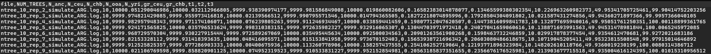
## `gLike` optimization across iterations, `kappa` = 50,000
* **Note:** This is actually 10 replicates, but they are all clustered tightly together (same seed for simulation and iterator, so not unexpected)
* Note: This is the trajectory of the log likelihood of 10 replicate simulation + inferences using gLike for the 3-pop ooa (3G09) scenario.
* 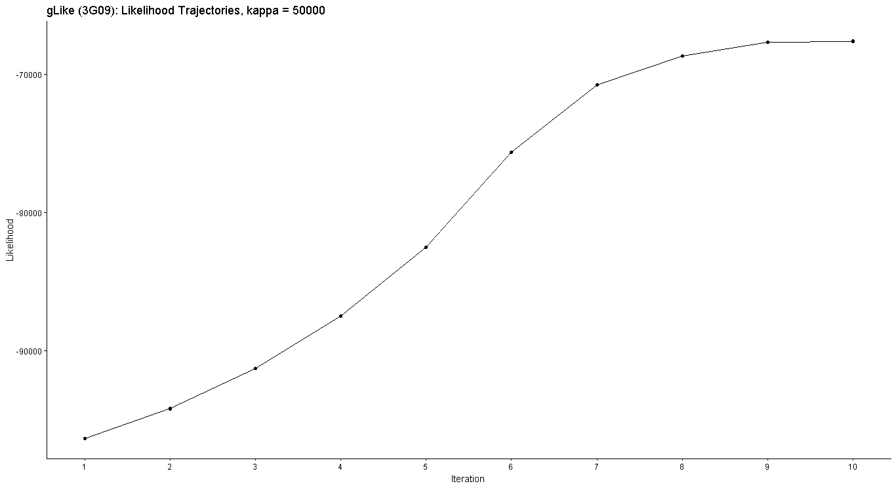
* **Note:** The dashed line indicates the true underlying value of the parameter used in the simulation.
* 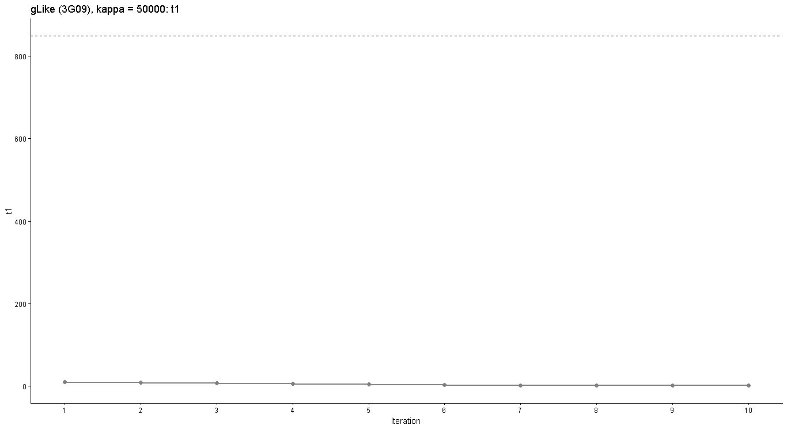
* 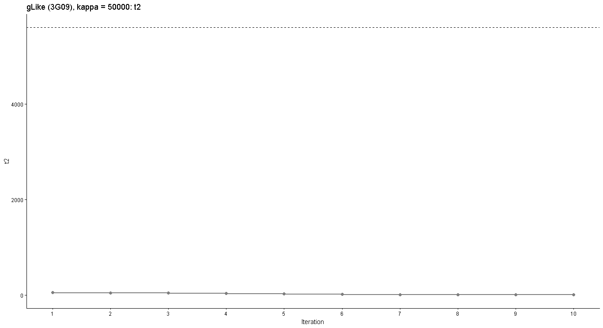
* 
* 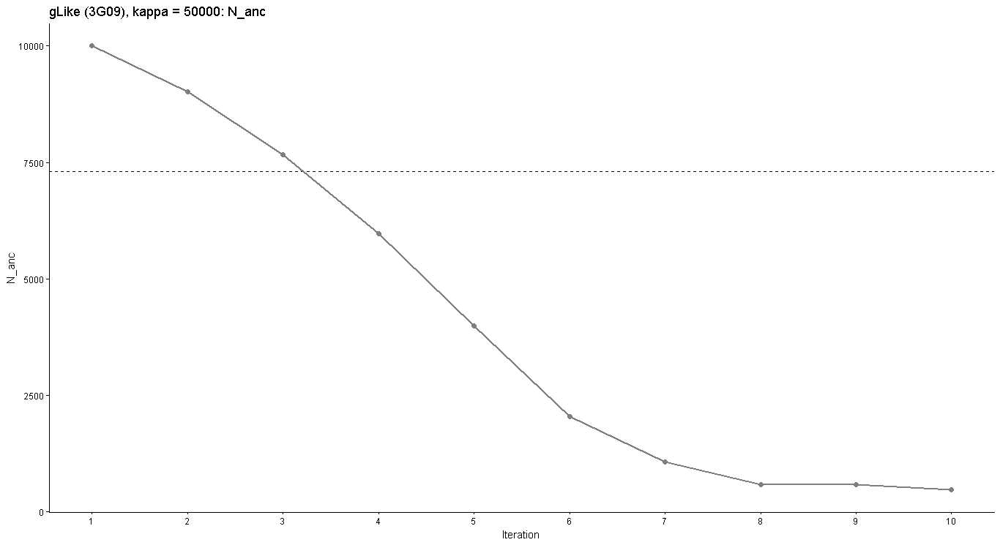
* 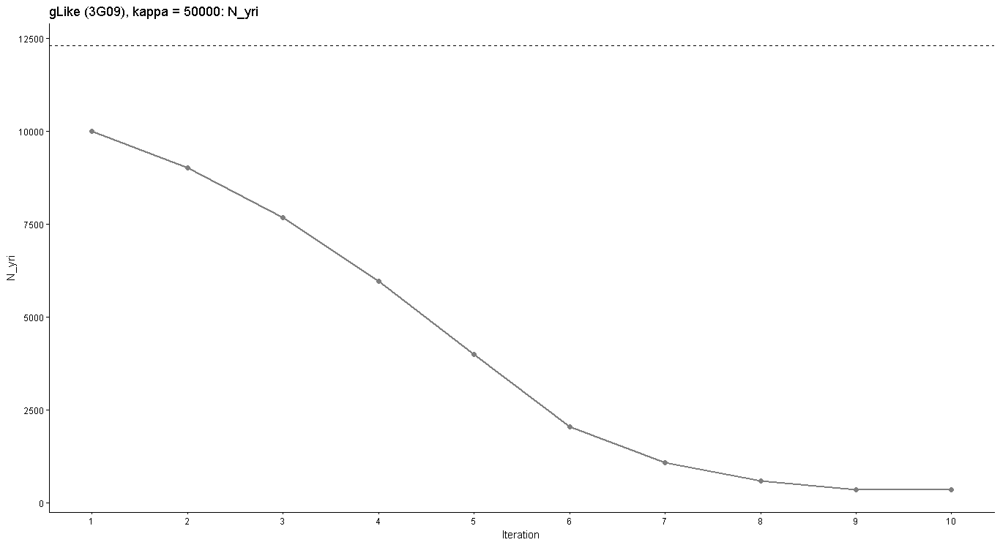
* 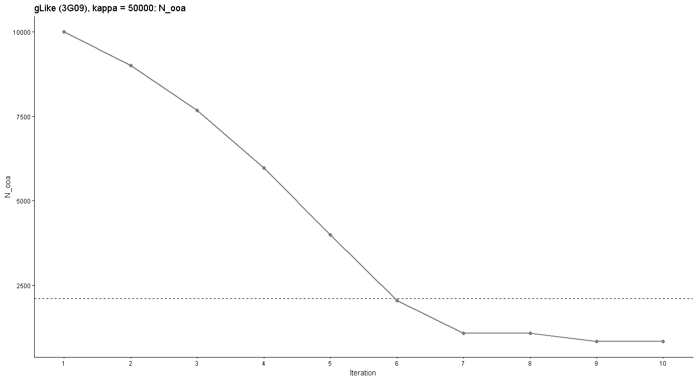
* 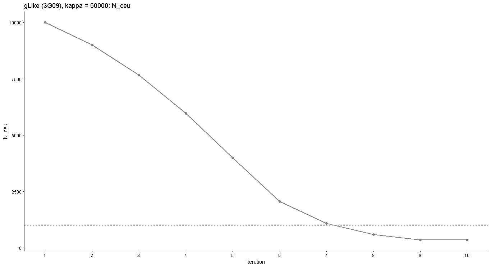
* 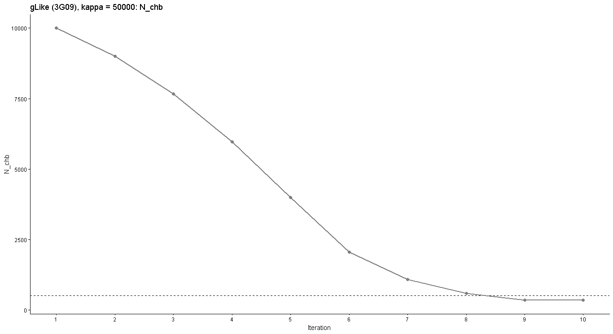
* 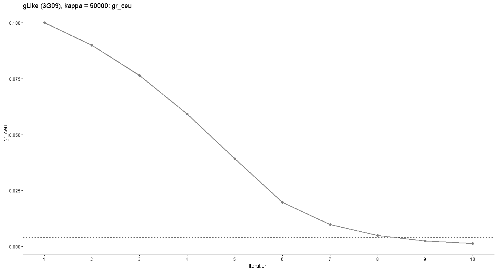
* 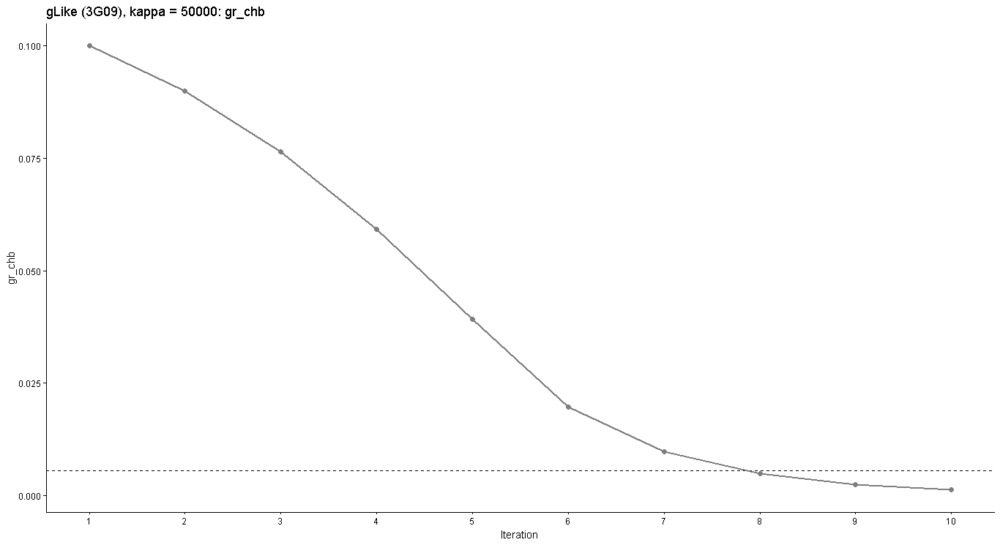

## `CMA-ES` with `kappa` = 50,000
* **Note:** `CMA-ES` doesn't have tradiational "epoch" structure -- instead there are a number of generations until a tolerance condition is met. Inside the generations, I'm not sure how to print out intermediate model states, so I was unable to make the same "iterative" plots as with the `gLike` optimizer.
* 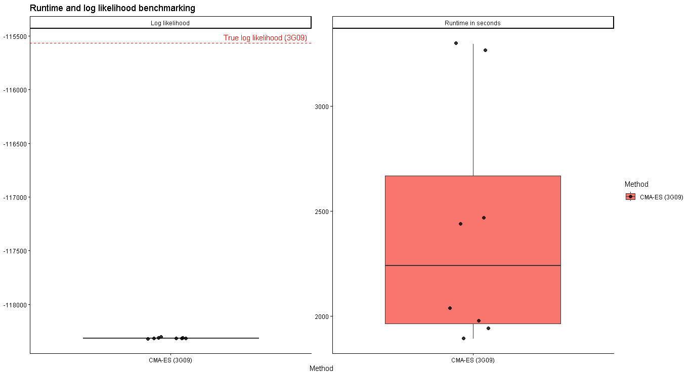
* Note: The blue square indicates the initial value (arbitrarily chosen)
* 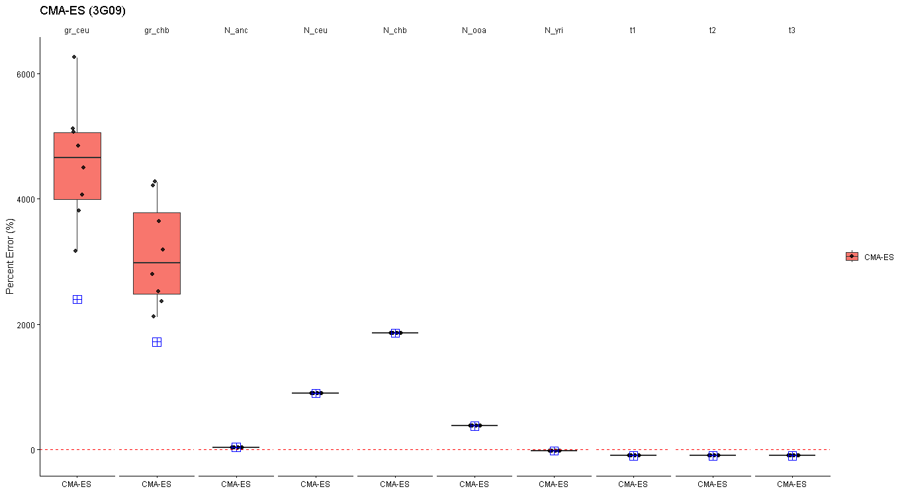

## TODO
* Internal scaling
* CMA-ES
    * Initial condition not moving
    * Overall acurracy
    * 980% success rate
    * Recode soft boundaries using if conditions
* Kappa tests (10k vs 20k vs 30k etc.)