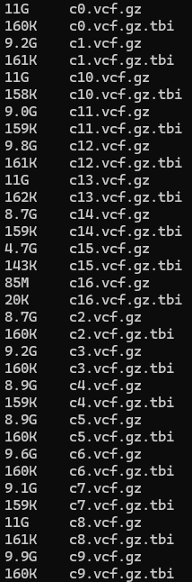
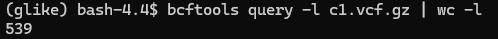

# 20280928

## `variational_gamma`

### Conda environment installation for `tsinfer + tsdate + biozarr`

1. **Overview**

This environment is used to process egnomic variation data through the `bio2zarr --> tsinfer --> tsdate` workflow. This environment assumes a `python` installation of version 3.11, with core packages including: `bio2zarr`, `tsinfer`, `tskit`, `tsdate`, `zarr` and several supporting numerical and genomics-related packages.

This environment was **built using a combination of conda-forge and PyPI packages**. Note: Some packages were install from conda-forge while others were installed through `pip`. This distinction is important, because the packages listed below represent the working environment as a whole, rather than a minimal set of packages which can be install via `conda install`.

2. **Creating the Conda environment**

The environment must first be created with the correct version of Python

```
conda create -n tsdate_vcz python=3.11
```

The specific version of python used in my environment is 3.11.16

Remember to activate the environment before use of scripts:

```
conda activate tsdate_vcz
```

For use on the USC CARC `discovery` server, I recommend the `conda-forge` channel for the conda-managed portion of the environment.

```
conda config --add channels conda-forge
conda aonfic --set channel_priority strict
```

3. Install core Conda packages

```
conda install -c conda-forge \
    python=3.11 \
    tsinfer=0.5.1 \
    tskit=1.0.3 \
    zarr=2.18.7 \
    scipy=1.16.3 \
    numba=0.67.0 \
    llvmlite=0.49.0 \
    numcodecs=0.15.1 \
    msgpack-python=1.2.2 \
    psutil=7.2.2 \
    python-lmdb=2.3.0 \
    pandas=3.0.5 \
    numpy=2.4.6
```
* `tsinfer`: Tree-sequence ancestry inference
* `tskit`: Tree-sequence data structures
* `zarr`: Internal data structure for `.vcz` data
* `scipy` Numerical computation
* `numba`: JIT compilation for numerical code
* `llvmlite`: `numba` LLVM dependency
* `numcodecs`: Compression used by `zarr`
* `msgpack-python`: Serialization
* `psutil`: System information
* `python lmdb`: : LMDB database interface

4. Install `bio2zarr`
`bio2zarr` is for converting the input `.vcf` data into the `.vcz` intermediate data-representation

I used `bio2zarr 0.1.4`.

I installed it with pip:

```
pip install bio2zarr==0.1.4
```

There are several PyPI dependencies:
```
appdirs              1.4.4
asciitree             0.3.3
click                 8.5.0
coloredlogs          15.0.1
donfig                0.8.1.post1
google-crc32c         1.8.0
humanfriendly        10.0
mpmath                1.4.1
numpy                 2.4.6
pandas                3.0.5
pyyaml                6.0.3
six                   1.17.0
tabulate              0.10.0
tqdm                  4.70.1
wrapt                 2.4.1
```
This should be automatically resolved by `pip` when installing `bio2zarr`

5. Install `tsdate`

The working version of `tsdate` is: `tsdate 0.2.7`.

I installed this with `pip`:

```
pip install tsdate==0.2.7
```

This is the combination of tree-sequence packages that I used:

```
tsinfer 0.5.1 
tskit 1.0.3 
tsdate 0.2.7
```

6. Additional genomic packages

There are a number of supplemental genomics packages

```
pip install \
    bed-reader==1.1.0 \
    cyvcf2==0.34.0 \
    pysam==0.24.1
```

* `bed-reader`: PLINK BED genotype data reading
* `cyvcf2`: efficient `.vcf` / `.bcf` access
* `pysam`: Python interfacing for `SAM`/`BAM`/`CRAM` and `tabix`/`bgzip`

7. Re-install `zarr` version 2.18.7

In my experience after solving the environment, downloading, installing, and updating packages, the conda environment will now have a *different* version of `zarr` which will cause some noncompatabilities.

**Note: The working version of `zarr` must be `zarr=2.18.7`**

```
conda install -c conda-forge zarr=2.18.7
```

8. Note: Blended environment (`conda-forge` and `pypi`)

If you `conda list`, you should output a combination of two different package origins, especially:

```
tsinfer       0.5.1    py311h0372a8f_0    conda-forge
tskit         1.0.3    py311h0372a8f_0    conda-forge
zarr          2.18.7   pyhd8ed1ab_0       conda-forge
bio2zarr      0.1.4    pypi_0              pypi
tsdate        0.2.7    pypi_0              pypi
numpy         2.4.6    pypi_0              pypi
pandas        3.0.5    pypi_0              pypi
pysam         0.24.1   pypi_0              pypi
```

Note that `tsinfer` and `tskit` were installed via `conda`, while `tsdate` was installed via `pypi`. This is the only way I was able to get things to work on my machine.

9. Python import order

I recommend using the following `python` import orders:

```
import tsinfer
from tsinfer.formats import VariantData
import tskit
import tsdate
```

And

```
import numpy as np
import zarr
```

### Current analysis state
* The current workflow status for each dataset is:
* `array_5388`
    * chr2 ── `.vcf.gz` ── [**ancestral + sorted `vcf.gz`**] ── `.vcz` ── `dedup.vcz` ── dated `.trees`
    * chr3 ── `.vcf.gz` ── ancestral + sorted `vcf.gz` ── [**`.vcz`**] ── `dedup.vcz` ── dated `.trees`
    * chr5 ── `.vcf.gz` ── ancestral + sorted `vcf.gz` ── `.vcz` ── [**`dedup.vcz`**] ── dated `.trees`
    * chr16 ─ `.vcf.gz` ── ancestral + sorted `vcf.gz` ── `.vcz` ── `dedup.vcz` ── [**dated `.trees`**]
* `meta_5688`
    * chr2 ── `.vcf.gz` ── ancestral + sorted ── [**`.vcz`**] ── `dedup.vcz` ── dated `.trees`
    * chr3 ── `.vcf.gz` ── ancestral + sorted `vcf.gz` ── `.vcz` ── [**`dedup.vcz`**] ── dated `.trees`
    * chr5 ── `.vcf.gz` ── ancestral + sorted `vcf.gz` ── `.vcz` ── [**`dedup.vcz`**] ── dated `.trees`
    * chr16 ─ `.vcf.gz` ── ancestral + sorted `vcf.gz` ── `.vcz` ── [**`dedup.vcz`**] ── dated `.trees`

## snpArcher

* 
    * There have been 16 successful filtering steps (results in staged multi-sample `.vcf.gz` files)
    * Note: This is different from the number of filtering steps that I implemented (which should be 8):
        * `variant_filtration`
        * `postprocess_basic_filter`
        * `qc_vcftools_individuals`
        * `postprocess_strict_filter`
        * `qc_subsample_snps`
        * `qc_prepare_plink_inputs`
        * `qc_plink`
        * `qc_setup_admixture`
    * I believe the remaining / ongoing steps are `snpArcher` internal filtering steps
* 
    * The intermediate output is confirmed to have the 539 individuals that we expect

### Mimicking CCDG Whole-Genome Sequencing Guidelines Using snpArcher

#### Overview

```
======================================================================
    snpArcher 2.0.0-dev-6209bb5
    Date:               2026-09-28 10:24:55
    Platform:           Linux-4.18.0-553.126.1.el8_10.x86_64-x86_64-with-glibc2.28
    Host:               a01-08.hpc.usc.edu
    User:               mahj
    Python:             3.11.4
    Snakemake:          9.26.0
    Conda:              25.11.0
    Conda env:          snparcher (/home1/mahj/.conda/envs/snparcher)
    Base directory:     /project2/mahj_1946/snpArcher/workflow
    Working directory:  /project2/mahj_1946/MEC_WGS_NH_546_gvcf
    Config file(s):     /project2/mahj_1946/MEC_WGS_NH_546_gvcf/config/config.yaml
    Command:            /home1/mahj/.conda/envs/snparcher/bin/snakemake -s workflow/Snakefile
                        --directory ../MEC_WGS_NH_546_gvcf/
                        --workflow-profile workflow-profiles/default/
                        --dryrun
    Profile:            workflow-profiles/default/
    Reference:          MEC_NH_546 (/project2/mahj_1946/MEC_WGS_NH_546_gvcf/ref_hg38.fa)
    Variant tool:       gatk
    Ploidy:             2
    Expected coverage:  high
    Intervals:          True
    Modules:            qc=True, postprocess=True
    Samples:            539 total (539 gvcf)
    Thread overrides:   bcftools_call=Resource("_cores", 8), bwa_mem=Resource("_cores", 16), clam_collect=Resource("_cores", 6), clam_loci=Resource("_cores", 6), deepvariant_call=Resource("_cores", 8), download_sra=Resource("_cores", 6), fastp=Resource("_cores", 6), gatk_genomics_db_import=Resource("_cores", 1), gatk_haplotypecaller=Resource("_cores", 1), gatk_haplotypecaller_interval=Resource("_cores", 1), glnexus_joint=Resource("_cores", 4), joint_genomics_db_import=Resource("_cores", 1), markdup_library=Resource("_cores", 16), mosdepth=Resource("_cores", 6), parabricks_haplotypecaller=Resource("_cores", 16), sentieon_combine_gvcf=Resource("_cores", 32), sentieon_dedup_library=Resource("_cores", 16), sentieon_haplotyper=Resource("_cores", 32), sentieon_map=Resource("_cores", 16)
    Resource overrides: bwa_mem: mem_mb=Resource("mem_mb", function(...)), runtime=Resource("runtime", 2880), concat_interval_vcfs: runtime=Resource("runtime", 1440), concat_interval_vcfs_stage: runtime=Resource("runtime", 1440), create_db_intervals: mem_mb=Resource("mem_mb", function(...)), mem_mb_reduced=Resource("mem_mb_reduced", function(...)), create_gvcf_intervals: mem_mb=Resource("mem_mb", function(...)), mem_mb_reduced=Resource("mem_mb_reduced", function(...)), default-resources: runtime=Resource("runtime", 300), gatk_genomics_db_import: mem_mb=Resource("mem_mb", function(...)), mem_mb_reduced=Resource("mem_mb_reduced", function(...)), runtime=Resource("runtime", 240), gatk_genotype_gvcfs: mem_mb=Resource("mem_mb", function(...)), mem_mb_reduced=Resource("mem_mb_reduced", function(...)), runtime=Resource("runtime", 1440), gatk_haplotypecaller_interval: mem_mb=Resource("mem_mb", function(...)), mem_mb_reduced=Resource("mem_mb_reduced", function(...)), genmap_index: disk_mb=Resource("disk_mb", 20000), mem_mb=Resource("mem_mb", 64000), runtime=Resource("runtime", 1440), glnexus_joint: mem_mb=Resource("mem_mb", function(...)), mem_mb_reduced=Resource("mem_mb_reduced", function(...)), joint_genomics_db_import: mem_mb=Resource("mem_mb", function(...)), mem_mb_reduced=Resource("mem_mb_reduced", function(...)), runtime=Resource("runtime", 1440), joint_genotype_gvcfs: mem_mb=Resource("mem_mb", function(...)), mem_mb_reduced=Resource("mem_mb_reduced", function(...)), runtime=Resource("runtime", 1440), markdup_library: mem_mb=Resource("mem_mb", function(...)), picard_intervals: mem_mb=Resource("mem_mb", function(...)), mem_mb_reduced=Resource("mem_mb_reduced", function(...))
======================================================================
```

```
SNAKEMAKE
=========
  Date: 2026-09-28 10:24:53
  Workflow ID: f3784c91-e3b3-4cad-bb8f-0728d7e283cb
  Platform: Linux-4.18.0-553.126.1.el8_10.x86_64-x86_64-with-glibc2.28
  Host: a01-08.hpc.usc.edu
  User: mahj
  Snakemake version: 9.26.0
  Python version: 3.11.4 | packaged by conda-forge | (main, Jun 10 2023, 18:08:17) [GCC 12.2.0]
  Command: /home1/mahj/.conda/envs/snparcher/bin/snakemake -s workflow/Snakefile --directory ../MEC_WGS_NH_546_gvcf/ --workflow-profile workflow-profiles/default/ --dryrun
  Snakefile: /project2/mahj_1946/snpArcher/workflow/Snakefile
  Base directory: /project2/mahj_1946/snpArcher/workflow
  Run directory: /project2/mahj_1946/snpArcher
  Working directory: /project2/mahj_1946/MEC_WGS_NH_546_gvcf
  Config file(s): ['/project2/mahj_1946/MEC_WGS_NH_546_gvcf/config/config.yaml']
  Config MD5: 758ea01b5aff0eaf9839bb73bd88a65b
```

Snakemake job DAG
```
job                               count
------------------------------  -------
combine_qc_metrics                    1
postprocess_filter_individuals        1
prepare_reference                     1
genmap_index                          1
index_reference                       1
qc_copy_qc_report                     1
genmap_mappability                    1
picard_intervals                      1
qc_contig_map                         1
filter_picard_intervals               1
mappability_bed                       1
callable_sites_bed                    1
create_db_intervals                   1
concat_interval_vcfs                  1
postprocess_update_bed                1
variant_filtration                    1
postprocess_basic_filter              1
qc_vcftools_individuals               1
postprocess_strict_filter             1
qc_subsample_snps                     1
postprocess_subset_indels             1
postprocess_subset_snps               1
qc_prepare_plink_inputs               1
postprocess_drop_indel_SNPs           1
qc_plink                              1
qc_setup_admixture                    1
qc_admixture                          1
qc_qc_dashboard                       1
all                                   1
total                                29
```

The goal of this workflow was the process the 539 MEC NH WGS dataset using `snpArcher` in a manner similar to that of the CCDG approach for producing a high quality population-scale multi-sample variant callset.

The workflow was configured around:

* a consistent GRCh38 reference assembly
* a cohort-level set of 539 `gvcf` samples
* GATK-based variant processing
* interval-based processing to make cohort-scale joint genotyping computationally tractable
* generation of mappability and callable-site resources
* cohort-level joint genotyping
* post-genotyping variant filtering
* sample-level QC
* removal/subsetting of problematic variants
* downstream genotype QC using PLINK and ADMIXTURE

The resulting Snakemake DAG contained 29 rule instances, although several of these rules **expand internally into many individual jobs**.

CCDG's published work provides precedent for a standardized, cohort-wide germline variant-calling process followed by variant and sample QC. For example, published CCDG callsets have used per-sample `.gvcf` calling followed by **joint calling, variant recalibration/filtering, decomposition/normalization, duplicate removal, and sample-level QC**.

1. Standardizing the reference genome

Our snpArcher configuration specifies:

```
Reference: MEC_NH_546 (GCA_000001405.29)
```

and the workflow generates:

* the reference FASTA
* a FASTA index (.fai)
* a sequence dictionary (.dict)
* BWA indices
* the associated compressed-reference index

This is important because CCDG-style processing emphasizes using the same reference assembly and patch version across samples. The Broad's discussion of the FE (functional equivalence) standard specifically notes that the reference should be identical across the dataset down to the patch version.

The relevant DAG stages were:

```
prepare_reference
index_reference
```

and the reference was also used to construct the mappability resources:

```
genmap_index
genmap_mappability
mappability_bed
```

Using a single GRCh38 reference ensures that coordinates, alignment, variant representation, and downstream annotation remain consistent across the cohort. This is particularly important for a population-scale callset intended for joint analysis.

2. Cohort-level input and joint-calling strategy

The snpArcher run was configured for:

```
Variant tool:       gatk
Ploidy:             2
Expected coverage:  high
Intervals:          True
Modules:            qc=True, postprocess=True
Samples:            539 total (539 gvcf)
```

Thus, rather than starting from FASTQ files and performing alignment and single-sample variant calling within this run, the workflow began **with 539 existing per-sample gVCFs**.

**This is consistent** with the GATK cohort-calling model in which samples are first represented as `.gvcf`s and subsequently combined and jointly genotyped. GATK describes the approach as:

* generate a GVCF for each sample
* consolidate the GVCFs
* jointly genotype the cohort
* filter the resulting cohort callset

This distinction is important: `snpArcher` was being used here primarily as a cohort joint-genotyping, filtering, and QC framework, **rather than** as a complete FASTQ-to-VCF pipeline.

3. Interval-based processing

Because the dataset contains hundreds of samples, the workflow uses **genomic intervals** to divide the joint-genotyping problem into manageable pieces.

The DAG contains:

```
picard_intervals
filter_picard_intervals
create_db_intervals
concat_interval_vcfs
```

The basic strategy is:

```
GRCh38 reference --> genomic intervals --> interval 1, 2, 3, ..., N, ---> interval-level joint genotyping --> concatenative `.vcf`s
```

This allows a very large cohort-level operation to be distributed across many independent genomic regions.

The workflow profile correspondingly gives substantial resources to the relevant GATK operations. For example:

```
gatk_genomics_db_import:
    mem_mb: attempt * 32000
    runtime: 240

gatk_genotype_gvcfs:
    mem_mb: attempt * 8000
    runtime: 1440

joint_genomics_db_import:
    mem_mb: attempt * 64000
    runtime: 1440

joint_genotype_gvcfs:
    mem_mb: attempt * 16000
    runtime: 1440
```

The DAG reports:

```
create_db_intervals       1
concat_interval_vcfs      1
```

but these rules orchestrate operations **over many intervals**.

4. Generating mappability resources

A major component of the workflow was explicit treatment of genomic regions that are difficult to map reliably.

The DAG contains:

```
genmap_index
genmap_mappability
mappability_bed
```

This establishes a mappability track from the reference genome.

The purpose is to identify regions where reads cannot be uniquely or reliably mapped. Such regions can produce elevated false-positive variant calls because apparent variation may actually result from ambiguous alignment.

This complements the broader CCDG/FE philosophy of using a standardized reference and carefully characterizing regions of the genome where variant calls can be considered reliable. The Broad's current GATK documentation likewise describes **callable-region analysis as a way of partitioning the genome into regions** with different levels of confidence based on sequencing/mapping characteristics.

In this run, the resulting mappability information feeds into the callable-region construction:

```
reference --> genmap_index --> genmap_mappability --> mappability_bed --> callable region construction
```

5. Defining callable genomic regions

The workflow then combines interval and mappability information to produce callable regions:

```
picard_intervals --> filter_picard_intervals --> mappability_bed + reference --> callable_sites_bed --> create_db_intervals
```

The goal is to distinguish regions of the genome that are appropriate for variant discovery from regions where mapping or other technical properties make variant calls less reliable.

One limitation should be explicitly documented: **the snpArcher log indicates that coverage-based callable-region generation was disabled for this dataset because the input consisted exclusively of gVCFs rather than per-base read/coverage information.** 

The workflow reported:

```
Coverage statistics and coverage BED generation are disabled because gVCF inputs do not provide per-base coverage.
```

Therefore, the callable-site component of this implementation should be understood primarily as a reference/mappability/interval-based approximation, rather than a complete empirical coverage-derived callable-genome analysis.

6. Joint genotyping of the cohort

The interval definitions feed into the GATK joint-genotyping portion of the workflow.

```
539 sample .gvcfs --> GenomicsDB / interval partioning --> joint genotype each interval --> interval `.vcfs` --> concat_interval_vcfs --> cohort VCF (joint multi-sample)
```

This is a key element of following the CCDG paradigm.

Joint genotyping provides a common genotype representation across the entire cohort **rather than treating each sample independently**. GATK specifically describes joint genotyping as producing a squared-off genotype matrix across all samples and variant sites, which facilitates cohort-wide analysis.

The DAG's `concat_interval_vcfs` stage subsequently reconstructs a genome-wide VCF from the interval-level results.

7. Post-genotyping variant filtering

After joint genotyping, the workflow performs explicit variant filtering:

```
variant_filtration
postprocess_basic_filter
postprocess_strict_filter
```

This establishes a multi-level filtering process:

```
raw joint-called .vcf --> variant_filtration --> postprocess_basic_filter --> postprocess_strict_filter --> high-confidence variant set
```

This is conceptually consistent with the GATK/CCDG approach in which **the initial joint-called set is intentionally sensitive** and **subsequent filtering** is used to reduce false positives.

GATK explicitly notes that `HaplotypeCaller`/`GenotypeGVCFs` produce calls that require downstream filtering, and **recommends VQSR for sufficiently large germline datasets**, with hard filtering being an alternative when VQSR is not appropriate.

CCDG's published callsets similarly performed **post-joint-call variant filtering/recalibration** before downstream cohort analyses.

**The present workflow should not be described as reproducing the exact CCDG VQSR procedure unless the actual snpArcher configuration demonstrates that VQSR was used with the same training resources and thresholds.**

**Note: The DAG shows `variant_filtration`, `postprocess_basic_filter`, and `postprocess_strict_filter`, rather than explicitly showing `VariantRecalibrator` and `ApplyVQSR` (as used in CCDG, but not natively available in `snpArcher`).**

8. Sample-level QC

The workflow also implements explicit sample-level QC:

```
qc_vcftools_individuals
qc_plink
qc_qc_dashboard
```

The resulting conceptual QC sequence is:

```
cohort-level .vcf --> individual-level QC --> missingness / genotype completeness --> sample-level variant statistics --> PLINK-based QC --> QC dashboard
```

This is particularly relevant to the CCDG-inspired design because high-quality variant calls alone do not guarantee a high-quality cohort. Individual samples can have:

* excessive missingness
* unusual genotype distributions
* contamination or technical problems
* sample swaps
* unexpected relationships
* or other anomalies

Published CCDG analyses explicitly performed sample-level QC, including removing samples with excessive missingness and investigating reported-versus-genetically inferred sex.

9. Individual/sample filtering

The DAG contains:

```
postprocess_filter_individuals
```

near the beginning of the post-processing chain.

This provides an explicit mechanism for removing samples that do not satisfy the desired QC criteria before finalizing the callset.

The presence of this stage is particularly important because a population-scale reference/callset should not simply maximize the number of samples. It should ensure that the samples retained in the final analysis satisfy predefined quality criteria.

10. SNP and indel separation

The workflow explicitly separates SNP and indel processing:

```
postprocess_subset_snps
postprocess_subset_indels
```

and later:

```
postprocess_drop_indel_SNPs
```

This allows SNP- and indel-specific QC and downstream analysis.

This is consistent with the broader CCDG approach, where SNVs and indels are treated as distinct variant classes during quality-control and representation steps. Published CCDG callset processing, for example, separately describes SNV and indel variant recalibration and subsequent decomposition/normalization.

11. SNP QC and population structure

The DAG workflow includes:

```
qc_subsample_snps
qc_prepare_plink_inputs
qc_plink
qc_setup_admixture
qc_admixture
```

This creates a second layer of QC beyond direct VCF filtering.

The conceptual workflow is:

```
filtered .vcf --> SNP subset / INDEL subset --> PLINK format conversion --> PLINK QC --> population-structure stratification (ADMIXTURE) --> ADMIXTURE analysis
```

The purpose is to identify unusual population structure or sample-level patterns that might indicate:

* unexpected ancestry
* sample misassignment
* outlying individuals
* population stratification
* other cohort-composition issues

12. QC reporting and reproducibility

The workflow concludes with:

**
combine_qc_metrics
qc_qc_dashboard
**

The QC stages aggregate the results of the preceding processing steps into a coherent report.

This is useful for documenting:

* how many samples entered the workflow
* how many samples passed QC
* variant counts
* filtering outcomes
* SNP/indel counts
* missingness
* population-structure results
* other QC statistics

The use of Snakemake also provides a reproducible dependency graph in which every processing step is explicitly represented.

13. Mapping the 29 DAG rules onto the CCDG-inspired workflow

The 29 rules can be grouped into six broad phases.

* Reference preparation (Establish a standardized GRCh38 reference and indexing)
    
        prepare_reference
        index_reference
        genmap_index	
* Genome accessibility/callability	(Define genomic regions suitable for reliable processing)
    
        genmap_mappability
        picard_intervals
        qc_contig_map
        filter_picard_intervals
        mappability_bed
        callable_sites_bed
        create_db_intervals	
* Cohort joint genotyping (Produce a cohort-wide jointly genotyped VCF)

        concat_interval_vcfs
        underlying interval-level GATK processing	
* Variant/sample filtering (Remove low-quality variants and samples)
    
        variant_filtration
        postprocess_basic_filter
        postprocess_strict_filter
        postprocess_filter_individuals	
* Population/genotype QC (Evaluate sample quality, SNP quality, and population structure)

        qc_vcftools_individuals
        qc_subsample_snps
        postprocess_subset_indels
        postprocess_subset_snps
        qc_prepare_plink_inputs
        postprocess_drop_indel_SNPs
        qc_plink
        qc_setup_admixture
        qc_admixture	
* Reporting/finalization (Aggregate QC results and produce the final deliverables)
    
        combine_qc_metrics
        qc_copy_qc_report
        qc_qc_dashboard
        postprocess_update_bed	

14. SLURM Workflow profile

```
executor: slurm
jobs: 100
use-conda: True
latency-wait: 20
retries: 3
```

This allowed the workflow to distribute computationally expensive genomic operations across the USC CACRC `discovery` HPC environment.

The profile also provided rule-specific resource allocations.

```
gatk_genomics_db_import:
    mem_mb: attempt * 32000

joint_genomics_db_import:
    mem_mb: attempt * 64000

gatk_genotype_gvcfs:
    mem_mb: attempt * 8000

joint_genotype_gvcfs:
    mem_mb: attempt * 16000
```

The use of attempt * ... also means that Snakemake can increase resource allocation on subsequent attempts when a job fails because of insufficient resources.

Similarly, the profile gives GenMap substantially more memory:

```
genmap_index:
    mem_mb: 64000
    disk_mb: 20000
    runtime: 1440
```

This was motivated by the computational demands of constructing whole-genome mappability resources. Earlier GenMap attempts demonstrated that this was a resource-intensive step: the workflow logs record an out-of-memory failure during GenMap index construction.

15. Relationship to CCDG/Functional Equivalence principles

The overall relationship can therefore be summarized as:

* Standardized reference --> GRCh39 index / mappability
* Cohort-level joint calling --> 539 gVCF files with interval-based joint genotyping
* rigorous QC/filtering in tiered steps --> variant QC + sample QC + population QC

CCDG protocol was thus mimicked at the workflow level, but not at the resolution of individual steps.

The implementation reproduces several important principles:

* Reference standardization
* Cohort-wide rather than isolated variant calling
* GVCF-based joint genotyping
* Explicit treatment of difficult/mappability regions
* Post-genotyping variant filtering
* Sample-level QC
* SNP/indel-specific processing
* Population-structure QC
* Reproducible workflow execution
* Centralized QC reporting

These principles are broadly consistent with the published CCDG and GATK population-scale variant-calling framework.

16. Important deviations and limitations

* The workflow uses snpArcher, rather than the exact CCDG production infrastructure and software versions. Therefore, it should be characterized as a CCDG/FE-inspired implementation.
* The workflow began with 539 gVCFs rather than starting from raw sequencing reads.
* Alignment, duplicate marking, and per-sample HaplotypeCaller were outside the scope of this particular run.
* Because the inputs were gVCFs, snpArcher reported that coverage statistics and coverage BED generation were disabled.
* Filtering should not be called CCDG VQSR unless VQSR was actually run
    * Currently best described as “post-genotyping variant filtering modeled on the CCDG/GATK quality-control framework”, rather than “CCDG VQSR.”
* GATK itself distinguishes VQSR from hard filtering and recommends VQSR when the dataset and available training resources support it.
* “We implemented a CCDG/Functional Equivalence–inspired whole-genome variant-calling and quality-control workflow using snpArcher, beginning with 539 per-sample gVCFs and proceeding through reference standardization, mappability and interval definition, cohort-level GATK joint genotyping, variant and individual filtering, and downstream PLINK/ADMIXTURE-based QC.”

## TODO
* `snpArcher`
    * Why 539 instead of 546?
    * Why are there more filtration steps then I expect?
    * Implement VSQR in an appropriate step
    * Write-up about it
* `variational_gamma`
    * Check to make sure correct array data
    * For duplicate variant positions, take highest frequency allele, throw out multi-allelic sites
    * Write about it