# 20260928: gLike

## Overview

Given the *time-based* performance improvemts of CMA-ES over gLike (natively), I tried some tests with varying the value of `kappa`.

## CMA-ES Update: Normalization

I figured out and implemented a normalization scheme on a per-parameter basis. I approximate a parameter scaling factor such that the normalized parameter should be between 0 and 1, thus a precision of 0.05 represents about a 5% wiggle-room.

As is, parameter scaling is encoded with the model, but if no parameter scaling is provided, then:

```
    if parameter_scales is None:
        parameter_scales = {}

        for name in x0:
            if name.startswith("N_"):
                parameter_scales[name] = 50000
            elif name.startswith("r"):
                parameter_scales[name] = 1.0
            elif name.startswith("m"):
                parameter_scales[name] = 1.0
            elif name.startswith("gr"):
                parameter_scales[name] = 1.0

    search = Search(
        x0,
        bounds=bounds,
        precision=precision,
        parameter_scales=parameter_scales
    )
```

```
==> CMA_kappa_25000_3G09_12401992_10.log <==
Generation   5  Likelihood = -107293.166932
{'t1': 8.334510437094382, 't2': 59.68465267922789, 't3': 1708.575814158042, 'N_anc': 12059.217950900636, 'N_yri': 10246.434112907484, 'N_ooa': 22631.802689245407, 'N_ceu': 13596.71109217734, 'N_chb': 12689.276711166853, 'gr_ceu': 0.0059836692876515385, 'gr_chb': 0.10002789904121603}

Final normalized parameters:
{'t1': 0.17009204973662004, 't2': 0.6631628075469765, 't3': 0.1717161622269389, 'N_anc': 0.24118435901801275, 'N_yri': 0.20492868225814967, 'N_ooa': 0.4526360537849081, 'N_ceu': 0.2719342218435468, 'N_chb': 0.25378553422333705, 'gr_ceu': 0.0059836692876515385, 'gr_chb': 0.10002789904121603}

Final demographic parameters:
{'t1': 8.334510437094382, 't2': 59.68465267922789, 't3': 1708.575814158042, 'N_anc': 12059.217950900636, 'N_yri': 10246.434112907484, 'N_ooa': 22631.802689245407, 'N_ceu': 13596.71109217734, 'N_chb': 12689.276711166853, 'gr_ceu': 0.0059836692876515385, 'gr_chb': 0.10002789904121603}
```

## CMA-ES Kappa results comparison

Increasing `kappa` substantially icnreases runtime, but doesn't offer substantial improvement in model fit. Quite annoyingly, I'm still finding cases where the logp of the best model is better fit than the actual true log likelihood. Quite annoyingly, there's still not that much movement in the parameters, despite normalization of scaling. Anecdotally, There are still only a maximum of 5 generations being brun using CMA-ES. I'm looking into tweaking this, but I think it's internal to the `cma` python package that I imported.

True values are shown as a dashed red line.

* 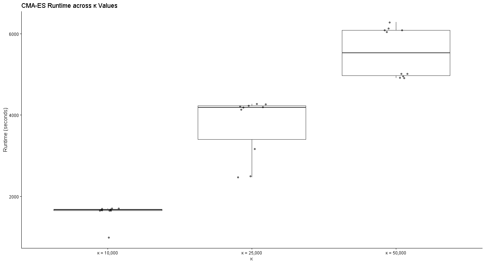
* 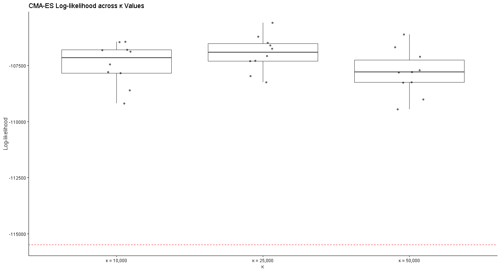
* 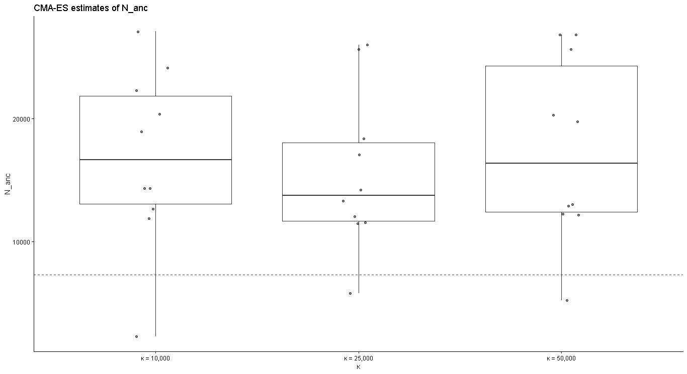
* 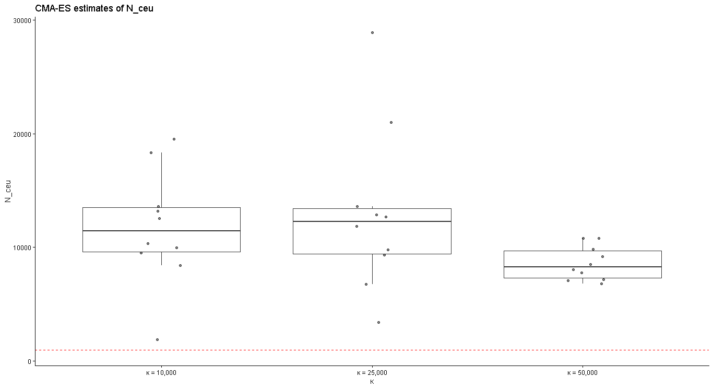
* 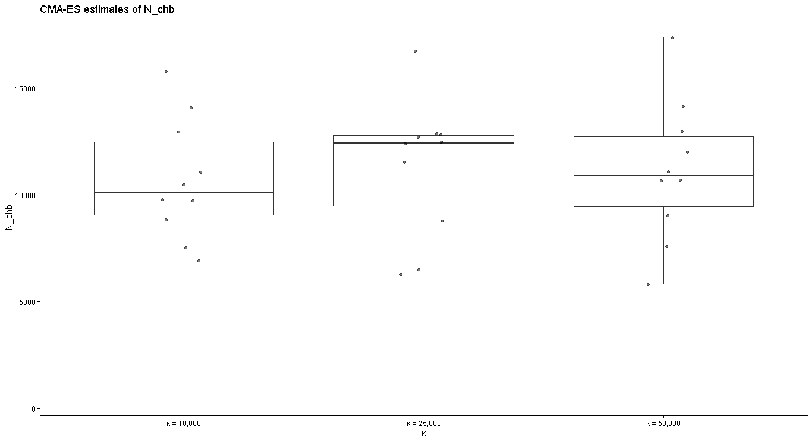
* 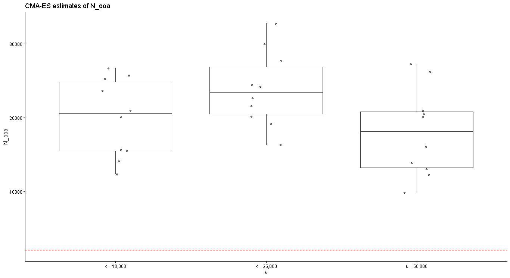
* 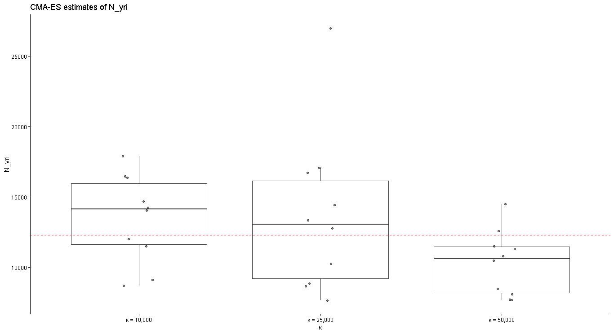
* 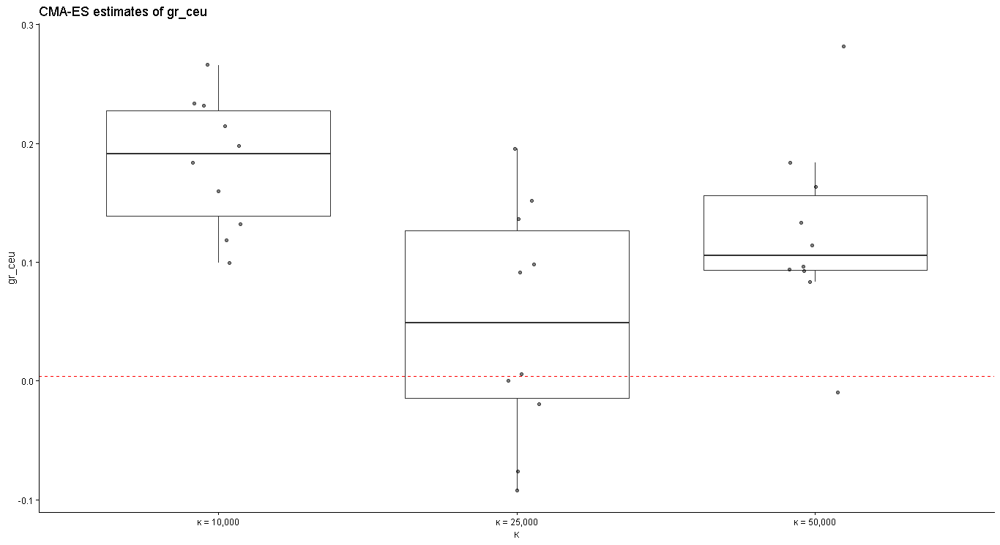
* 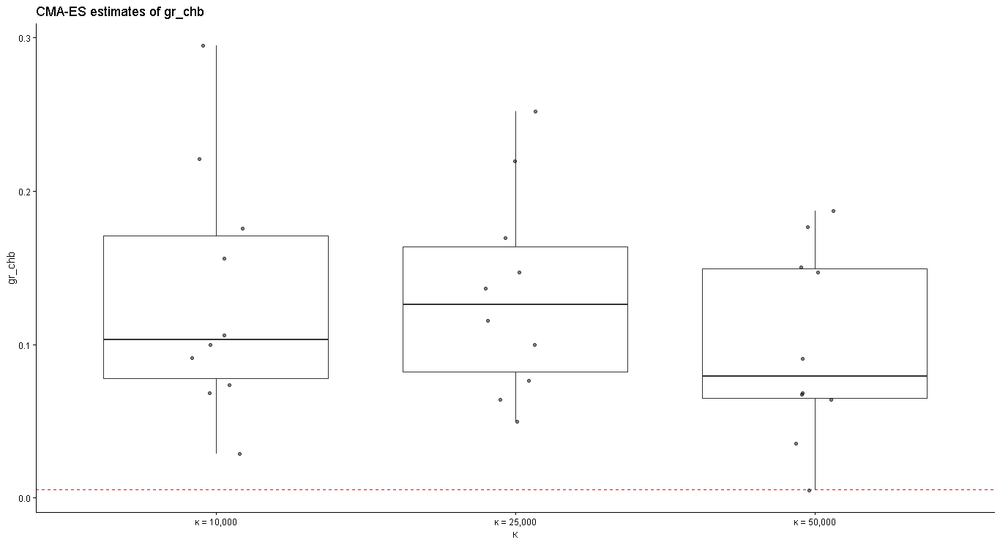
* 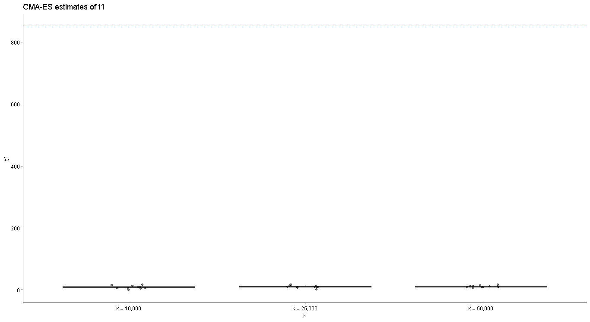
* 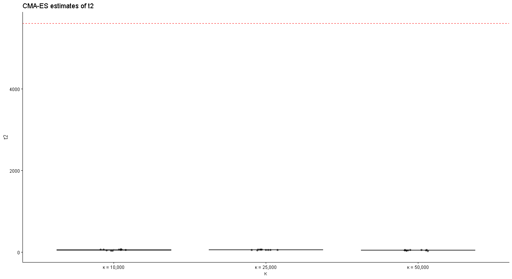
* 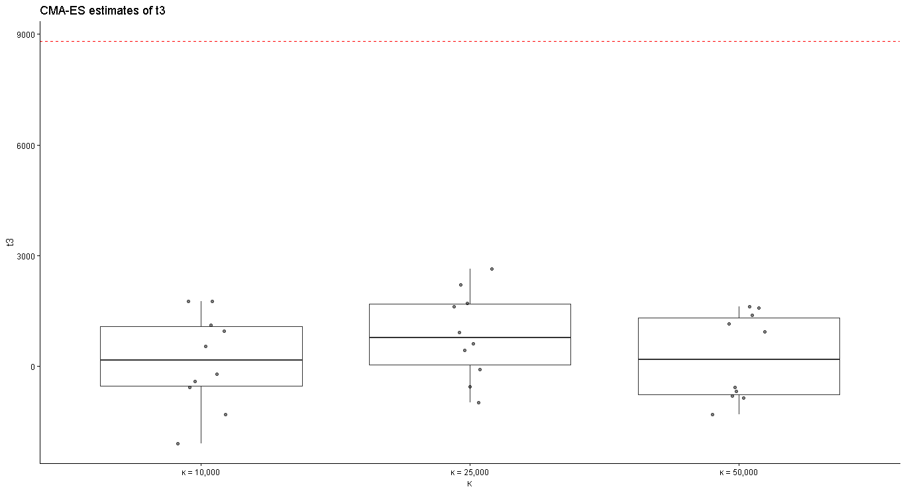